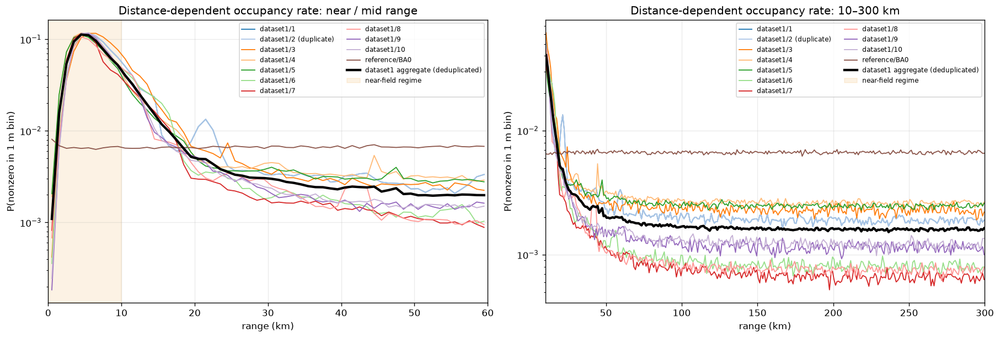
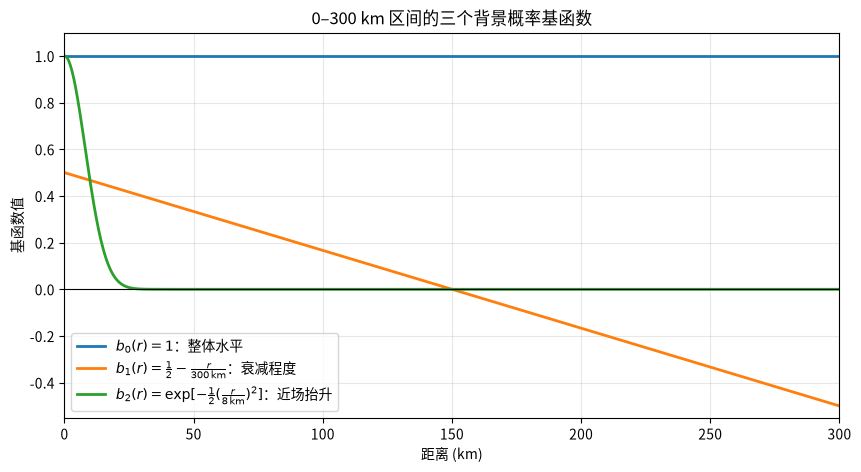

# 激光测距二值响应数据合成方案

## 1. 目标与数据约定

本方案用于构造与 `dataset1` 具有相似背景规律的二值激光测距数据，并在背景上叠加可控的移动目标。
- 每一帧对应一次激光发射，帧间隔为 $50\ \mathrm{ms}$，每秒 20 帧数据
- 每帧数据包含 $R=300000$ 个距离 bin，每个 bin 对应 $1\ \mathrm{m}$
- 每个合成样本包含 $F=300$ 帧数据，对应 15 秒观测

每个样本数据可以看作背景噪声点和目标轨迹点叠加构成。全文固定使用 $t\in\{0,1,\dots,F-1\}$ 表示帧索引、$r\in\{0,1,\dots,R-1\}$ 表示 1 m 距离 bin 索引：

- 给定该帧已生成的帧级调节系数 $c_t$，背景矩阵中的单个二值单元 $B_{t,r}\in\{0,1\}$ 服从 Bernoulli 分布：
    $$
    P(B_{t,r}=b\mid c_t)
    =
    \begin{cases}
    p_t(r;c_t), & b=1,\\
    1-p_t(r;c_t), & b=0,
    \end{cases}
    $$

    其中 $p_t(r;c_t)$ 是在给定 $c_t$ 后，第 $t$ 帧在距离 $r$ 处出现背景响应（单元值为 1）的最终边际概率
    
- 注入目标后的最终矩阵记为：
    $$
    X_{t,r}\in\{0,1\},
    $$
    
    $X_{t,r}=1$ 表示第 $t$ 帧在距离 $r$ 处被背景或目标响应，$X_{t,r}=0$ 表示未响应。整个合成、保存和读取过程都只处理 0/1。

## 2. 原始数据分析

### 2.1 数据使用范围

常规场景只使用去重后的稳定样本：`dataset1/1、3、4、6、7、9、10`。

- `dataset1/2` 与 `dataset1/1` 完全重复，不作为独立样本参与拟合。
- `dataset1/5` 和 `dataset1/8` 含连续低计数区间，不参与常规背景包络拟合；它们用于后续掉帧或接收异常压力测试。
- 距离 bin 0 几乎全 1，拟合和生成时默认置零，若后续需要应单独注入。
- `BA0` 属于另一种近似均匀背景体制，不与 `dataset1` 混合拟合。

### 2.2 样本统计特性

数据合成的核心困难在于：现有数据只有若干个离散的 `dataset1` 样本，但合成实验需要不断产生**新的、规律相似但又不完全重复**的背景概率曲线。

设 $t$ 表示帧，$r$ 表示 1 m 距离 bin，$j\in\mathcal J$ 表示一个稳定真实样本，$k\in\{0,1,\ldots,K-1\}$ 表示由 $r$ 聚合得到的 1 km 距离组；$\hat p_{j,k}$ 是样本 $j$ 在距离组 $k$ 上的经验响应概率。每个样本转换为 300 个经验响应率 $\hat p_{j,k}$，构成一条“距离—背景概率”曲线 $\hat{\boldsymbol p}_j$。如下图所示，不同样本的 $\hat{\boldsymbol p}_j$ 具有相似的总体衰减形状，但在整体背景水平、远近衰减程度和 0–10 km 近场抬升上存在差异，同时还包含局部随机起伏。

以下结果摘自 [`data/raw/check.ipynb`](../../raw/check.ipynb)。对去重且无明显低计数段的稳定样本 `dataset1/1、3、4、6、7、9、10` 进行统计分析。考察以下核心指标：

1. `mean events/frame`：一个样本中每帧响应数（bin=1）的平均值
2. Fano 系数：衡量一个计数随机变量的波动程度相对于泊松分布是更大还是更小，定义为 $F=\frac{\text{Var}(N)}{\mathbb{E}(N)}$。这里 $N:=N_t$ 为帧响应数，指标衡量不同时刻每一炮收到光子总数的波动情况：
    - $F=1$ 对应泊松型波动，直观表现为接受的光子完全随机、独立达到；
    - $F<1$ 表示比泊松过程更规则的欠离散情况，可能存在死时间、排斥效应或人为周期约束
    - $F>1$ 表示比泊松过程更不规则的过度离散情况，表现为光子成簇到达、波动偏大，存在局部时间关联结构
3. $\bar p$：相应距离段内每个 bin 的平均响应概率。即随机选取该距离段中的一帧、一个 1 m bin，其取值为 1 的经验概率
4. `10 km+ spatial-pair excess`：10 km 以上相邻 bin 同时为 1 的观测次数，与按各 bin 边际概率独立计算的期望次数之比，该比值大于 1 表示存在局部空间关联结构

结果如下：
| 指标 | 稳定样本的范围 | 数据特性及对合成的含义 |
|---|:---|---|
| `mean events/frame` | $1035$–$1687$ | 样本间整体背景水平约相差 $1.6$ 倍，不能只用一个固定背景水平；第 3 章用 $\theta_0$ 连续调节这一差异。 |
| Fano | $1.37$–$1.92$ | 帧总响应数存在温和波动；第 3 章用 $c_t$ 作为独立的帧级调节旋钮，并以该范围作为参考。 |
| $\bar p(0\text{--}10\ \mathrm{km})$ | $0.0643$–$0.0740$ | 近场响应率高，且稳定样本间变化相对较小；用 $\theta_2$ 单独调节近场抬升。 |
| $\bar p(10\text{--}50\ \mathrm{km})$ | $0.00530$–$0.00922$ | 从近场到中程已下降约一个数量级；它与远场共同约束距离衰减的形状。 |
| $\bar p(100\text{--}300\ \mathrm{km})$ | $0.000677$–$0.00262$ | 远场非常稀疏且样本间相对差异最大；用 $\theta_1$ 连续调节远近衰减程度，并在真实范围外留少量余量。 |
| `10 km+ spatial-pair excess` | $1.57$–$2.26$ | 始终大于 $1$，表明相邻距离 bin 并非完全独立；第 3 章加入少量 1–3 m 空间簇结构。 |

这些数值说明：
1. `dataset1` 的共同规律不是“全距离均匀的随机点”，而是**近场高、远场低的距离衰减背景**。因此首先需要拟合一条公共响应概率衰减曲线模板
2. 近场的跨样本变化约为 $1.15$ 倍，远场约为 $3.9$ 倍，整体背景水平也相差约 $1.6$ 倍。因此合成模型需要在公共模板上用参数化调节噪声整体水平、远近衰减程度和近场抬升程度
3. 稳定样本 Fano 为 $1.37$–$1.92$，说明每帧响应总数会整体偏多或偏少。因此合成模型需能整体调节帧内所有位置的响应倾向，使这类帧级波动可以独立开关和调节。
4. 空间相邻对超额比始终大于 $1$，所以只按 $p_{\boldsymbol\theta}(r)$ 独立采样不足以复现真实背景。合成模型需先生成局部结构种子，再随机延伸 1–3 m，以保留相邻 bin 的局部聚集结构。

## 3. 场景 B：连续可调的 dataset1 背景

数据合成模型不直接复制某一个样本，也不把所有原始矩阵混在一起。它把问题分成三个层次：第一层学习总体衰减形状；第二层加入 “帧内响应整体偏多或偏少” 以及 “具备空间聚集结构” 的规律；第三层才构造响应采样方法。

### 3.0 三阶段总览

| 阶段 | 对应步骤 | 解决的问题 | 主要输出 |
|---|---:|---|---|
| A. 拟合基础距离模板 | 1–7 | 从多个稳定真实样本中提取公共距离衰减形状 | $p_{\boldsymbol\theta}(r)$ |
| B. 构造相关背景概率 | 8–9 | 把目标边际概率换算成空间簇种子概率，并加入每帧共同的概率波动 | $q(r)$、$c_t$、$q_t(r)$ |
| C. 采样最终二值矩阵 | 10 | 按种子概率生成 0/1，再让种子随机延伸 1–3 m 并作逻辑或 | $B_{t,r}$ |

1. 阶段 A 的作用是生成一条参数化的、连续可调的逐 1 m bin 响应概率模板。它先把每个真实样本的概率曲线变换和平滑，再提取跨样本公共响应概率基准曲线，最后用三个基函数作参数化微调得到 $p_{\boldsymbol\theta}(r)$ 
2. 阶段 B 在 $p_{\boldsymbol\theta}(r)$ 基础上引入局部空间聚集和帧级波动
    - 首先处理局部空间聚集，模型反求局部结构种子概率 $q(r)$，使这些种子扩展后，在基准帧中仍恢复到目标边际概率 $p_{\boldsymbol\theta}(r)$；
    - 随后用帧级系数 $c_t$ 把 $q(r)$ 调节为当前帧的 $q_t(r)$，使同一帧的背景响应整体偏多或偏少，从而产生帧响应总数的波动
3. 阶段 C 进行随机采样：先由 $q_t(r)$ 生成二值种子，再让种子随机延伸 0–2 m，最后用逻辑或合并。这样既能控制每个距离位置为 1 的概率，也能复现相邻距离 bin 的相关性，而且输出始终只有 0/1。

本章会反复使用几种概率，它们的含义如下：

| 符号 | 含义 | 是否直接用于最终采样 |
|---|---|---|
| $\hat p_{j,k}$ | 真实样本 $j$ 在第 $k$ 个 1 km 距离组上的经验响应率 | 否，用于拟合 |
| $p_{\boldsymbol\theta}(r)$ | 新场景在基准帧中的逐 1 m 目标边际概率；当 $c_t=1$ 时，空间扩展后的最终概率应回到它 | 否，用于反求种子概率 |
| $q(r)$ | 基准帧、空间扩展前的种子概率 | 否，还要经过帧级调节 |
| $q_t(r)$ | 第 $t$ 帧经过 $c_t$ 调节后的种子概率 | 是，用于采样种子 |
| $p_t(r;c_t)$ | 给定 $c_t$ 后，种子采样和空间扩展共同产生的最终边际响应概率 | 它描述最终 $B_{t,r}$ |

因此，从真实样本到最终背景矩阵的主流程可以压缩为：

$$
\left\{B^{(j)}_{t,r}\right\}_{j\in\mathcal J}
\xrightarrow[\text{步骤 1--7}]{\text{拟合距离模板}}
p_{\boldsymbol\theta}(r)
\xrightarrow[\text{步骤 8}]{\text{空间簇校正}}
q(r)
\xrightarrow[\text{步骤 9}]{\text{帧级调节}}
q_t(r)
\xrightarrow[\text{步骤 10}]{\text{种子采样、扩展和逻辑或}}
B_{t,r}.
$$

其中 $a_j(k)$、$\tilde a_j(k)$ 和 $\bar a(k)$ 只是阶段 A 内部的确定性数值曲线，不写入最终数据。下面的 3.1–3.10 将按上述顺序细化每一步。

### 3.1 步骤 1：统计经验距离响应率

对真实稳定样本 $j$，记其二值矩阵为 $B^{(j)}_{t,r}$，帧数为 $F_j$。为降低逐 1 m 概率估计的方差，把由 $r$ 表示的距离 bin 按 $W=1000\ \mathrm{m}$ 聚合，得到 $K=\frac{R}{W}=300$ 个距离组。其中第 $k$ 个距离组对应的 1 m bin 集合为：

$$
\mathcal R_k
=
\{r\mid kW\leq r<(k+1)W\},
\qquad
k=0,1,\ldots,K-1.
$$

每个距离组总 bin 数为 $F_jW$，组内取值为 1 的数据点总数为 $C_{j,k}=\sum_{t=0}^{F_j-1}\sum_{r\in\mathcal R_k}B^{(j)}_{t,r}$。样本 $j$ 中距离组 $k$ 的平均响应概率估计为

$$
\hat p_{j,k}
=
\frac{C_{j,k}+\tfrac{1}{2}}
{F_jW+1}.
$$

其中小修正保证估计有定义。由 $K=300$ 个 $\hat p_{j,k}$ 组成样本 $j$ 的拟合输入曲线：

$$
\hat{\boldsymbol p}_j
=
\left(\hat p_{j,0},\hat p_{j,1},\ldots,\hat p_{j,K-1}\right).
$$

### 3.2 步骤 2：把概率映射到便于拟合的数值坐标

我们的核心思路是**通过引入基函数实现响应概率曲线的参数化控制**，这会涉及到基函数加权求和。若直接在概率空间做加法，结果可能小于 0 或大于 1。因此，先用单调一一映射把概率转换到可自由相加的实数坐标 $a$ 上，完成拟合和基函数调节后，再映射回合法的 Bernoulli 概率。

使用以下函数 $\mathcal H(a)$ 将任意实数 $a$ 压回合法概率区间 $(0,1)$：

$$
\mathcal H(a)
=
1-\exp[-\exp(a)],
\qquad
\mathcal H:\mathbb R\rightarrow(0,1).
$$
.png)

它的反函数会把接近 0 或 1 的概率拉开，便于在数值坐标上拟合：

$$
\mathcal H^{-1}(p)
=
\log[-\log(1-p)],
\qquad
0<p<1.
$$
.png)

当前选择的 $\mathcal H$ 称为 complementary log-log 映射，它特别适合当前的稀疏背景：当 $p\ll1$ 时，

$$
\mathcal H^{-1}(p)
=
\log[-\log(1-p)]
\approx
\log p.
$$

因此，若在坐标空间加入某个基函数组合 $\Delta(k)$，在概率空间低概率区就对应指数倍的概率提升，即

$$
\begin{aligned}
a_{\boldsymbol\theta}(k) &= \bar a(k)+\Delta(k) \\
p_{\boldsymbol\theta}(k) &\approx \bar p(k)\exp[\Delta(k)].
\end{aligned}
$$

该映射选型适合**用线性组合的基函数描述远距离低概率区的跨样本差异**，和第2节所述的样本特点吻合
> 映射函数并非唯一，只要是从实数轴单调映射到 $(0,1)$ 的函数，都可保证最终概率合法。当前选择的 complementary log-log 映射在低概率区近似 $\log p$，所以适合本方案的比例型变化，这是数值建模上的便利，而不是物理模型假设
> 
> 不同映射会改变 “坐标上加同一个量” 在概率上的实际含义，若替换映射，须重新拟合基函数系数和参数采样范围

### 3.3 步骤 3：平滑每条样本曲线

有限帧数会使相邻 1 km 区间的经验概率产生随机起伏。当前实现沿距离组索引 $k$ 方向对数值坐标 $a_j(k)$ 进行一维高斯平滑：

$$
\tilde a_j(k)
=
\sum_{d=-\infty}^{+\infty}w_d\,a_j(k-d),
\qquad
w_d
=
\frac{\exp\!\left(-\dfrac{d^2}{2\sigma_k^2}\right)}
{\displaystyle\sum_{u=-\infty}^{+\infty}
\exp\!\left(-\dfrac{u^2}{2\sigma_k^2}\right)}.
$$
其中 $d$ 是相对距离组的偏移量，$w_d$ 是对应的权重，且 $\sum_d w_d=1$。当前每个距离组宽 1 km，使用标准差 $\sigma_k=1.5$ 的高斯核，大约在 $k\pm4.5$ km 以外的权重已很小

> 一维高斯平滑就是用一个高斯形状的滑动窗口，对一维序列做加权平均，从而削弱噪声和快速波动。普通算数平均计算时各点权重相同，而高斯平均计算时，越靠近中心的点权重越大
> 
> 实现中使用有限长度的离散核；在 $0$ km 和 $300$ km 两端，超出范围的位置取最近的边界值，避免边缘位置缺少邻居而出现异常下降。

### 3.4 步骤 4：提取跨样本公共基准曲线

对每个距离区间 $k$，从参与常规模型拟合的稳定样本集合 $\mathcal J$ 取全部稳定样本平滑曲线的中位数，得到跨样本的公共基准响应概率曲线
$$
\bar a(k)
=
\operatorname{median}_{j\in\mathcal J}
\tilde a_j(k),
$$

### 3.5 步骤 5：用三个基函数描述样本间差异

以公共基准曲线为中心，用三个基函数构造连续场景：

$$
a_{\boldsymbol\theta}(k)
=
\bar a(k)
+\theta_0b_0(k)
+\theta_1b_1(k)
+\theta_2b_2(k).
$$

三个基函数定义为：

$$
b_0(k)=1,
$$

$$
b_1(k)=\frac{1}{2}-\frac{r_k}{300\ \mathrm{km}},
$$

$$
b_2(k)=
\exp\left[-\frac{1}{2}
\left(\frac{r_k}{8\ \mathrm{km}}\right)^2\right],
$$
其中 $r_k=(k+\tfrac12)W$ 是第 $k$ 个 1 km 距离组的中心距离。

如图所示，三个参数分别控制：
- $\theta_0$：整体背景水平；增大时所有距离的响应概率共同上升。
- $\theta_1$：远近衰减程度；增大时近场概率上升、远场概率下降，衰减更陡。
- $\theta_2$：0–10 km 近场抬升；主要改变近场杂波，不明显改变远场。

### 3.6 步骤 6：拟合真实样本参数并设定连续调节范围

对每个稳定样本 $j$，用最小二乘拟合其三个参数：

$$
\boldsymbol\theta_j
=
\underset{\boldsymbol\theta}{\arg\min}
\sum_{k=0}^{K-1}
\left[
\tilde a_j(k)
-\bar a(k)
-\sum_{i=0}^{2}\theta_i b_i(k)
\right]^2.
$$

这样，每条真实概率曲线都变成三维参数空间中的一个点 $\boldsymbol\theta_j$。

对第 $i$ 个参数，记真实样本中的最小值和最大值为 $\theta_i^{\min}$、$\theta_i^{\max}$，中点为 $m_i=\frac{\theta_i^{\min}+\theta_i^{\max}}{2}$。将真实范围向外扩展 $\eta=25\%$：

$$
\theta_i^-
=
m_i-(1+\eta)(m_i-\theta_i^{\min}),
$$

$$
\theta_i^+
=
m_i+(1+\eta)(\theta_i^{\max}-m_i).
$$

当前脚本不拟合 $\boldsymbol\theta$ 的联合概率分布，也不会在生成一次样本时自动随机抽取 $\boldsymbol\theta$。它对每个参数提供一个归一化旋钮 $u_i\in[-1,1]$：
$$
\theta_i(u_i)
=
m_i
+u_i\frac{\theta_i^+-\theta_i^-}{2}.
$$
$u_i=-1$、$0$、$1$ 分别对应扩展下界、中点和扩展上界。三个旋钮在当前实现中彼此独立，因此它**定义的是参数空间中的长方体包络**，通过各自从 $[-1,1]$ 均匀抽取 $u_i$，可连续产生真实样本之间以及略超出实测范围的新概率曲线

### 3.7 步骤 7：恢复 Bernoulli 概率并插值到 1 m

为避免参数组合生成不合理曲线，脚本先在数值坐标 $a$ 上施加逐距离包络。记 $\eta=25\%$，则：

$$
a_k^-
=
\min_{j\in\mathcal J}\tilde a_j(k)-\log(1+\eta),
\qquad
a_k^+
=
\max_{j\in\mathcal J}\tilde a_j(k)+\log(1+\eta).
$$

将步骤 5 生成的坐标裁剪为：

$$
a_{\boldsymbol\theta}^{\mathrm{clip}}(k)
=
\min\!\left\{
a_k^+,
\max\!\left(a_k^-,a_{\boldsymbol\theta}(k)\right)
\right\}.
$$

再转换回 1 km Bernoulli 概率：

$$
p_{\boldsymbol\theta}(k)
=
\mathcal H\!\left(a_{\boldsymbol\theta}^{\mathrm{clip}}(k)\right),
\qquad
0<p_{\boldsymbol\theta}(k)<1.
$$

这不是在概率空间直接加减 $25\%$。在远场低概率区，$a$ 上的 $\pm\log(1+\eta)$ 近似对应概率乘以 $1+\eta$ 或除以 $1+\eta$；在近场较高概率区，实际概率边界由 $\mathcal H$ 的非线性决定。

随后在数值坐标上对裁剪后的 1 km 曲线做**线性插值**，得到逐 1 m 模板：

$$
a_{\boldsymbol\theta}(r)
=
\operatorname{LinearInterp}
\left[a_{\boldsymbol\theta}^{\mathrm{clip}}(k)\right],
$$

$$
p_{\boldsymbol\theta}(r)
=
\mathcal H\!\left(a_{\boldsymbol\theta}(r)\right).
$$

$1$ km 中心之外的两端使用最近的边界坐标值；插值完成后，$r=0$ 位置被显式置为 0。$p_{\boldsymbol\theta}(r)$ 是后续求解种子概率并生成 Bernoulli 背景所使用的逐距离基础概率模板。中间数值坐标 $a$ 不写入最终数据。

### 3.8 步骤 8：校正空间簇的种子概率

`dataset1` 在 10 km 以上的**相邻距离 bin 同时为 1 的次数高于独立期望**，直接独立采样无法复现这种局部相邻关系。因此，步骤 8 先暂取 $c_t=1$，为后续空间扩展建立基准种子概率 $q(r)$；所谓“种子”是随机出现的局部关联起点。在基准情形下，第 $t$ 帧会在距离 $r$ 处以概率 $q(r)$ 采样种子 $S_{t,r}\in\{0,1\}$；第 3.9 节才会把它调节为 $q_t(r)$：
- 当 $S_{t,r}=1$ 时，当前位置必定被响应，并可能向更远距离延伸 1–3 m
- 当 $S_{t,r}=0$ 时，该位置不主动生成局部关联结构

等价地，一个种子会生成长度为 $0$ 到 $3$ m 的局部响应段 $[r,r+L]$。

在引入种子的情况下，进一步考虑如何保持**基准**最终 bin 的响应概率仍是 $p_{\boldsymbol\theta}(r)$。令 $e_d$ 表示“在已经出现种子的条件下，该种子至少延伸到 $d$ m”的条件概率：

$$
e_1=s,
\qquad
e_2=0.55s,
\qquad
e_3=0.25s.
$$

这里 $s$ 是空间簇强度参数：$s$ 越大，种子越容易延伸，相邻 1–3 m bin 同时为 1 的机会越高。
> 为使 $e_1,e_2,e_3$ 都是合法概率且满足嵌套关系，数学上必须限制
> $$
> 0\leq s\leq1,
> \qquad
> 1\geq e_1\geq e_2\geq e_3\geq0.
> $$
> 当前实际使用的 $s$ 满足 $0\leq s\leq0.25$，即设置了更严格的保护上限 $s_{\max}=0.25$：若要达到目标空间聚集程度而需要更大的 $s$，生成器会报错，而不会生成过强、缺乏实测依据的空间簇。

扩展采用嵌套规则：延伸到 3 m 必然也延伸到前 1–2 m，即
$$
P(L\geq d\mid S_{t,r}=1)=e_d,
\qquad d=1,2,3.
$$
> 例如 $s=0.2$ 时，$e_1=0.20$、$e_2=0.11$、$e_3=0.05$：一个已经出现的种子有 $0.80$ 的概率不延伸，有 $0.09$ 的概率只延伸 1 m，有 $0.06$ 的概率延伸到 2 m，有 $0.05$ 的概率延伸到 3 m。

针对基础模板 $p_{\boldsymbol\theta}(r)$ 递推求解 $q(r)$，即可保证空间扩展后的最终边际概率仍等于 $p_{\boldsymbol\theta}(r)$：

$$
1-p_{\boldsymbol\theta}(r)
=
(1-q(r))
\prod_{d=1}^{3}
\left[1-e_dq(r-d)\right].
$$
其中当 $r-d<0$ 时取 $q(r-d)=0$。

> 该式的目标是让最终 bin 在距离 $r$ 处为 0 的概率恰好等于基础模板要求的 $1-p_{\boldsymbol\theta}(r)$。
> 
> 一个最终 bin $r$ 要保持为 0，必须同时满足四件事
> 1. $r$ 自己没有种子，概率为 $1-q(r)$；
> 2. $r-1$ 处没有种子延伸 1 m 到这里，概率为 $1-e_1q(r-1)$；
> 3. $r-2$ 处没有种子延伸 2 m 到这里，概率为 $1-e_2q(r-2)$；
> 4. $r-3$ 处没有种子延伸 3 m 到这里，概率为 $1-e_3q(r-3)$。
> 
> 所有这些条件同时成立的概率是 $(1-q(r)) \prod_{d=1}^{3} \left[1-e_dq(r-d)\right]$，令其等于目标的零概率 $1-p_{\boldsymbol\theta}(r)$ 即可解出局部种子概率 $q(r)$。从近距离向远距离计算时，$q(r-1)$、$q(r-2)$、$q(r-3)$ 已知，因此可递推解出当前的 $q(r)$。

参数 $s$ 不是固定指定的，而是根据目标空间聚集程度进行数值标定。首先从稳定 dataset1 的 10 km 以上区域计算相邻距离 bin 对比值：

$$
R_{\mathrm{sp}}
=
\frac{\text{实际相邻 bin 同时为 1 的次数}}
{\text{按独立背景预测的相邻对次数}}.
$$

完全独立时 $R_{\mathrm{sp}}\approx1$；数值越大，局部空间聚集越强。`cluster` 旋钮从稳定样本的 $R_{\mathrm{sp}}$ 取值范围（向外扩展 25%）中选择目标值 $R_{\mathrm{target}}$。因此 `cluster=0` 表示该区间的中点，并不表示关闭空间簇；严格关闭空间簇需要令 $s=0$（即 $R_{\mathrm{target}}=1$），当前命令行接口没有单独的“关闭空间簇”开关。

对每个候选 $s$，先令 $(e_1,e_2,e_3)=s(1,0.55,0.25)$，并在 1 km 粗分辨率上根据对应的概率模板 $p_{\boldsymbol\theta}(k)$ 求近似种子概率 $q_s^{\mathrm{coarse}}(k)$。这里的 1 km 仅用于把缓慢变化的距离概率近似为局部常数，从而快速标定 $s$；它不表示空间簇会延伸 1 km，最终簇长度始终为 1–3 m。再由该近似种子概率计算候选 $s$ 产生的预测聚集指标 $\widehat R_{\mathrm{sp}}(s)$。因为 $s$ 越大，种子延伸越频繁，$\widehat R_{\mathrm{sp}}(s)$ 通常单调增大，所以程序从 $s=0.02$ 起建立上下界，再用 45 次二分搜索找到满足

$$
\widehat R_{\mathrm{sp}}(s)\approx R_{\mathrm{target}}
$$

的 $s^\ast$；若需要 $s>0.25$ 才能达到目标，则停止并报错。得到 $s^\ast$ 后，才使用前述递推式在逐 1 m 分辨率上求得最终的 $q_{s^\ast}(r)$。至此得到空间簇机制的基准种子概率 $q(r)$。以上过程可表示为
$$
R_{\mathrm{target}}
\;\xrightarrow{\text{二分搜索 }s}\;
s^\ast
\;\xrightarrow{\text{递推求解}}\;
q_{s^\ast}(r).
$$

### 3.9 步骤 9：帧级响应概率调节

完成步骤 8 后，$q(r)$ 已给出具有正确空间簇强度的基准种子概率。现在进一步为每个帧 $t$ 生成帧级概率调节系数，使整帧背景可以共同偏亮或偏暗。

定义最终背景矩阵中第 $t$ 帧的非零 bin 数为 $N_t=\sum_{r=0}^{R-1}B_{t,r}$，注意到稳定 dataset1 的 $N_t$ 存在小幅帧间波动，因此令：

$$
c_t
=
\exp\left(\sigma_c Z_t-\frac{\sigma_c^2}{2}\right),
\qquad
Z_t\sim\mathcal N(0,1)
$$

该设计满足 $\mathbb E[c_t]=1$。其中 $\sigma_c$ 控制帧间波动强度：
- $c_t>1$ 表示本帧各距离位置整体更容易为 1
- $c_t<1$ 则整体更不容易为 1

> 数据合成脚本中， `gain` 是控制每帧总背景点数波动大小的归一化旋钮，范围为 $[-1,1]$，它会决定 $\sigma_c$ 的取值。
> 
> 脚本先对每个稳定 dataset1 样本，沿该样本的全部帧 $t$ 计算一个 Fano factor，组成样本级集合；再取其中最小值、最大值，以二者中点为中心将区间宽度向外扩展 $25\%$。
> $$
> \operatorname{Fano}(N)
> =
> \frac{\operatorname{Var}(N_t)}
> {\mathbb E[N_t]}.
> $$
> 
> 随后：
> - gain=-1：取该 Fano 范围下界，帧间波动较小；
> - gain=0：取范围中点；
> - gain=1：取范围上界，帧间波动较大。
> 
> 脚本通过稀疏背景下的近似关系把目标 Fano factor 换算为 $\sigma_c$，过程如下：
>
> 先记未做帧级调节时，一帧背景 1 的期望总数为
> $$
>  \mu=\sum_{r=0}^{R-1}p_{\boldsymbol\theta}(r).
> $$
> 在暂不考虑步骤8的稀疏二值背景中，$p_{\boldsymbol\theta}(r)$ 很小时有 $p_t^{\mathrm{ind}}(r)\approx c_t p_{\boldsymbol\theta}(r)$，因此给定 $c_t$ 后，
> $$
>  \mathbb E[N_t\mid c_t]\approx c_t\mu.
> $$
> 帧内逐 bin 的 Bernoulli 随机采样本身带来约为 $\mu$ 的方差；不同帧的共同调节系数 $c_t$ 额外带来约为 $\mu^2\operatorname{Var}(c_t)$ 的方差。因此
> $$
> \operatorname{Var}(N_t)
> \approx
> \mu+\mu^2\operatorname{Var}(c_t), \\
> \operatorname{Fano}(N)
> \approx
> 1+\mu\operatorname{Var}(c_t).
> $$
> 若 `gain` 指定的目标值为 $\operatorname{Fano}_{\mathrm{target}}$，脚本先反解
> $$
> v_c
> =
> \max\!\left(
> \frac{\operatorname{Fano}_{\mathrm{target}}-1}{\mu},
> 0
> \right).
> $$
> 这里 $v_c$ 是所需的 $\operatorname{Var}(c_t)$。又因为
> $$
> c_t =
> \exp\left(\sigma_cZ_t-\frac{\sigma_c^2}{2}\right)
> \quad\Longrightarrow\quad
> \operatorname{Var}(c_t)=\exp(\sigma_c^2)-1,
> $$
> 所以最终取
> $$
> \sigma_c
> =
> \sqrt{\log(1+v_c)}.
> $$
> 这套换算只使用稀疏 Bernoulli 背景的方差近似，不涉及累计光子数。加入空间簇以及概率变换的非线性后，最终实测 Fano factor 会与目标值存在小偏差。若要严格关闭帧级调节，应设 $\sigma_c=0$，当前命令行接口没有单独开关。

在不考虑步骤 8 的情况下，如下使用参数 $c_t$ 调节基础噪声占用概率：
$$
p_t^{\mathrm{ind}}(r)
=
1-\left[1-p_{\boldsymbol\theta}(r)\right]^{c_t}.
$$

该变换等价于对“保持为 0 的概率”作幂变换：

$$
1-p_t^{\mathrm{ind}}(r)
=
\left[1-p_{\boldsymbol\theta}(r)\right]^{c_t}.
$$

其优点可概括为：

1. **始终是合法概率。** 无论 $c_t$ 取何正值，均有 $0\leq p_t^{\mathrm{ind}}(r)\leq1$。
2. **低概率区近似按比例调节。** 当 $p_{\boldsymbol\theta}(r)$ 很小时，
   $$
   p_t^{\mathrm{ind}}(r)
   \approx
   c_t p_{\boldsymbol\theta}(r).
   $$
   因此 $c_t=2$ 近似表示该帧背景概率翻倍，$c_t=0.5$ 近似表示减半，符合直觉。
3. **只引入帧级共同波动。** 同一个 $c_t$ 同时作用于该帧所有距离位置，使该帧的总背景数可以整体偏多或偏少；由于不同帧的 $c_t$ 独立抽取，它不主动制造跨帧持续关联。

$\mathbb E[c_t]=1$ 的作用是让调节系数本身没有长期偏向。在低概率区，结合上式有

$$
\mathbb E\left[p_t^{\mathrm{ind}}(r)\right]
\approx
\mathbb E[c_t]p_{\boldsymbol\theta}(r)
=
p_{\boldsymbol\theta}(r),
$$

因此它近似保持总体平均噪声概率不变。这里的“近似”很重要：由于幂变换是非线性的，$\mathbb E[c_t]=1$ 并不严格推出 $\mathbb E[p_t^{\mathrm{ind}}(r)]=p_{\boldsymbol\theta}(r)$；在远场稀疏背景中该偏差很小，若要在较高概率区严格保持均值，则需额外进行数值校正。

上述公式仅是无空间簇的对照。**实际生成器将 $c_t$ 作用于步骤 8 得到的种子概率 $q(r)$，通过调节该帧中局部关联结构的起点数量，控制整帧背景偏亮或偏暗**。得到最终的 $q_t(r)$ 如下：
$$
q_t(r)
=
1-\left[1-q(r)\right]^{c_t}.
$$

### 3.10 步骤 10：生成最终二值背景

在步骤 9 已得到第 $t$ 帧的种子概率 $q_t(r)$。本步骤的顺序是：
1. 先在每个距离位置随机生成种子
2. 让每个已经出现的种子随机延伸 0–3 m
3. 最后把所有种子和延伸结果做逻辑或，得到最终二值背景矩阵 $B_{t,r}$

**第一步：采样种子。** 对每个距离 $r$，独立按当前帧的种子概率采样：

$$
S_{t,r}\mid c_t
\sim
\operatorname{Bernoulli}\!\left(q_t(r)\right).
$$

$S_{t,r}=1$ 表示 $r$ 是一个局部关联结构的起点；$S_{t,r}=0$ 表示这里不主动产生簇。注意，一个位置即使 $S_{t,r}=0$，仍可能被前方种子的延伸响应。

**第二步：决定每个种子的延伸长度。** 对每个种子起点 $r_0$，生成一个均匀随机数 $U_{t,r_0}\sim\operatorname{Uniform}(0,1)$，并定义：

$$
E_{t,r_0,d}
=
\mathbf 1\!\left\{U_{t,r_0}<e_d\right\},
\qquad d=1,2,3.
$$

这里 $E_{t,r_0,d}=1$ 表示种子从 $r_0$ 延伸到 $r_0+d$。同一个 $U_{t,r_0}$ 同时用于 $d=1,2,3$；又因为 $e_1\geq e_2\geq e_3$，所以延伸到 3 m 必然也延伸到 1 m 和 2 m，满足前述嵌套规则。

**第三步：合并所有种子和延伸。** 对最终位置 $r$，只要以下任一事件发生，$B_{t,r}$ 就置为 1：它自己是种子，或 $r-1$ 的种子延伸 1 m 到这里，或 $r-2$ 的种子延伸 2 m 到这里，或 $r-3$ 的种子延伸 3 m 到这里。即：

$$
B_{t,r}
=
S_{t,r}
\lor
\left(S_{t,r-1}\land E_{t,r-1,1}\right)
\lor
\left(S_{t,r-2}\land E_{t,r-2,2}\right)
\lor
\left(S_{t,r-3}\land E_{t,r-3,3}\right).
$$

其中 $\lor$ 表示逻辑“或”，$\land$ 表示逻辑“与”；当 $r-d<0$ 时，对应项直接忽略。不同种子产生的簇即使重叠，逻辑或的结果仍然只是 1，不会产生大于 1 的值。

> 例如某个种子位于 $r_0$，且其随机数满足 $e_3\leq U_{t,r_0}<e_2$，则它延伸到 2 m 但不延伸到 3 m，最终使 $r_0$、$r_0+1$、$r_0+2$ 三个 bin 都为 1。

因此 $B_{t,r}$ 始终只有 0/1。给定已经生成的 $c_t$，它在固定 $(t,r)$ 时仍是 Bernoulli 变量，其最终边际概率为：

$$
p_t(r;c_t)
=
P(B_{t,r}=1\mid c_t)
=
1-\left[1-q_t(r)\right]
\prod_{d=1}^{3}
\left[1-e_dq_t(r-d)\right].
$$

这个表达式是对前三步结果的概率描述：最终位置 $r$ 为 0，必须同时满足“它自己不是种子”以及“更近的 1–3 m 位置的种子均未延伸到这里”；右侧的乘积就是这些条件同时成立的概率，取补集后得到给定 $c_t$ 时最终为 1 的概率 $p_t(r;c_t)$。

当 $c_t=1$ 时，上式与前述递推式对应，因此 $p_t(r;1)=p_{\boldsymbol\theta}(r)$。当 $c_t\neq1$ 时，$c_t$ 先改变种子概率再经空间扩展改变最终 $p_t(r;c_t)$；它使整帧响应水平同步升降，但通常不再严格等于本节的无空间簇对照公式 $p_t^{\mathrm{ind}}(r)$。不同距离 bin 的 $B_{t,r}$ 因共享的扩展机制而相关，但不会产生大于 1 的值。

这种做法把三个性质分开控制：$p_{\boldsymbol\theta}(r)$ 决定基础距离衰减和基准响应水平，$c_t$ 决定帧级整体波动，$s$ 决定局部 1–3 m 聚集程度。

### 3.11 与拟合、生成脚本的对应

第 3.1–3.10 节已经给出了完整的建模逻辑。实现拆分为两个脚本：`fit_dataset1.py` 只读取真实 `dataset1` 数据并输出模型；`generate_dataset1.py` 只读取该模型并批量生成合成背景。

| 文档步骤 | 主要实现 | 结果 |
| --- | --- | --- |
| 3.1–3.3 | `fit_dataset1.py`：`profile_real_sample`、`fit_dataset1`、`gaussian_filter1d` | 原始矩阵先二值化、屏蔽 bin 0，再得到 $\hat p_{j,k}$、$a_j(k)$ 与 $\tilde a_j(k)$。 |
| 3.4–3.6（拟合部分） | `fit_dataset1.py`：`fit_dataset1` | 计算 $\bar a(k)$、三个基函数、真实样本系数和连续可调范围，并写入模型文件。 |
| 3.6 | `generate_dataset1.py`：`step_3_6_select_coefficients` | 将三个归一化距离曲线旋钮映射到模型保存的连续系数范围，得到本样本的 $\boldsymbol\theta$。 |
| 3.7 | `generate_dataset1.py`：`step_3_7_restore_probability` | 由平滑真实曲线现场构建 $a$ 空间包络；用 $\boldsymbol\theta$ 构造、裁剪并恢复 Bernoulli 概率，插值后得到 $p_{\boldsymbol\theta}(r)$。 |
| 3.8 | `generate_dataset1.py`：`step_3_8_prepare_spatial_clusters` | 根据 `cluster` 标定 $s,e_1,e_2,e_3$，并求出基准种子概率 $q(r)$。 |
| 3.9 | `generate_dataset1.py`：`step_3_9_prepare_frame_adjustment` | 根据 `gain` 与目标 Fano 生成 $c_t$，并准备按帧块计算 $q_t(r)$。 |
| 3.10 | `generate_dataset1.py`：`step_3_10_generate_binary_background` | 按 Bernoulli 规则采样种子，以共享随机数进行 1–3 m 嵌套扩展，并用逻辑或得到 $B_{t,r}$。`generate_batch` 负责循环生成、保存文件与批次清单。 |

两个脚本中的 `intensity`、`log_intensity` 等变量名仅表示概率变换后的**数值坐标**，不表示返回幅值、光子数或任何需要额外采样的物理强度。整个生成过程只进行二值事件的 Bernoulli 采样；最终数组为 `np.bool_`。`np.packbits` 与 `np.unpackbits` 仅负责二值矩阵的存储压缩与恢复，输出字段的具体格式见第 6 章。

## 4. 移动目标合成

本节对应检查笔记本中的随机目标生成与注入逻辑。默认每个样本包含 $F=300$ 帧，帧间隔为 $\Delta t=0.05\,\mathrm{s}$，即总时长为 $15\,\mathrm{s}$。所有目标与背景数据均为二值值 $0/1$。

### 4.1 潜在轨迹

令 $t=0,\ldots,F-1$。实现先生成白噪声序列，并以长度为 $W$ 的一维均值核做卷积：

$$
\epsilon_t\sim\mathcal N(0,1),
\qquad
\tilde a_t=[h_W*\epsilon]_t,
\qquad
h_W(i)=\frac{1}{W}.
$$

卷积取与原序列等长的输出，边界处按零填充处理。再将平滑序列归一化并缩放为加速度：

$$
a_t
=
\mathrm{curve\_strength}\cdot a_{\max}
\cdot
\frac{\tilde a_t}{\max_u|\tilde a_u|}.
$$

其中 $a_{\max}$ 是 $\mathrm{max\_acceleration\_mps2}$；当 $\mathrm{curve\_strength}=0$ 时，加速度为零，轨迹为严格直线。初始速度和后续速度按下式生成：

$$
v_0\sim\mathcal U(-0.8v_{\max},\,0.8v_{\max}),
$$

$$
v_t
=
\operatorname{clip}
\left(
v_{t-1}+a_{t-1}\Delta t,\,
-v_{\max},\,v_{\max}
\right),
\qquad t\ge1.
$$

令相对位移为：

$$
d_0=0,
\qquad
d_t=\sum_{u=0}^{t-1}v_u\Delta t.
$$

为使整条轨迹均处于设定距离区间 $[r_{\min},r_{\max}]$，起点按下式均匀采样：

$$
r_0
\sim
\mathcal U
\left(
r_{\min}-\min_t d_t,\,
r_{\max}-\max_t d_t
\right),
$$

并令：

$$
r_t^*=r_0+d_t.
$$

若该起点区间为空，当前实现会报错，而不是截断或反射轨迹。

### 4.2 测距抖动与离散距离 bin

当前实现只使用单一零均值高斯测距抖动，不使用混合高斯或额外的大偏差状态：

$$
\eta_t\sim\mathcal N(0,\sigma_{\mathrm{meas}}^2).
$$

目标实际注入的距离 bin 为：

$$
\tilde r_t
=
\operatorname{clip}
\left(
\operatorname{round}(r_t^*+\eta_t),\,
0,\,R-1
\right),
$$

其中 $R=300000$。抖动只改变目标响应落入的离散 bin，不改变连续潜在轨迹 $r_t^*$。

### 4.3 目标注入概率与漏检

对目标所在 bin $\tilde r_t$，当前实现使用本次背景场景恢复出的参考距离响应率 $p_{\boldsymbol\theta}(r)$，而不使用带帧级调节的 $p_t(r;c_t)$。先以目标相对背景倍率 $\kappa$ 构造候选响应值：

$$
p_{\mathrm{candidate},t}(\tilde r_t)
=
\max
\left\{
p_{\boldsymbol\theta}(\tilde r_t),\,
\kappa p_{\boldsymbol\theta}(\tilde r_t)
\right\}.
$$

该候选值不设置 $p_{\max}$ 上限；当 $\kappa p_{\boldsymbol\theta}(\tilde r_t)>1$ 时，它可大于 $1$，但只作为计算注入概率的中间量。实现先反解额外注入 $1$ 的原始概率，再由配置中的上下限统一裁剪：

$$
q_t
=
\operatorname{clip}
\left(
\operatorname{clip}
\left(
\frac{
p_{\mathrm{candidate},t}(\tilde r_t)
-
p_{\boldsymbol\theta}(\tilde r_t)
}{
1-p_{\boldsymbol\theta}(\tilde r_t)
},
0,\,1
\right),
q_{\min},\,q_{\max}
\right).
$$

其中 $q_{\min}$、$q_{\max}$ 分别是 $\mathrm{min\_injection\_probability}$、$\mathrm{max\_injection\_probability}$。目标注入事件为：

$$
Z_t\sim\operatorname{Bernoulli}(q_t).
$$

这里 $Z_t=1$ 表示本帧额外注入一个目标响应，$Z_t=0$ 即目标漏检。当前实现中，各帧的 $Z_t$ 在给定 $q_t$ 后独立生成；未额外实现连续漏检区间或断点机制。

### 4.4 背景与目标合并

设已生成的二值背景为 $B_{t,r}$。目标的二值矩阵只在其量化距离 bin 处可能为 $1$：

$$
T_{t,r}
=
Z_t\,\mathbf 1(r=\tilde r_t).
$$

最终输入轨迹检测器的二值矩阵为：

$$
X_{t,r}=B_{t,r}\lor T_{t,r}.
$$

该设计的原理是：背景与额外注入独立时，目标所在位置的参考总响应率满足：

$$
\Pr(X_{t,\tilde r_t}=1)
=
p_{\boldsymbol\theta}(\tilde r_t)
+
\left[1-p_{\boldsymbol\theta}(\tilde r_t)\right]q_t.
$$

因此，未触及 $q_{\min}$、$q_{\max}$ 裁剪且候选值位于 $[0,1]$ 时，上式严格等于 $p_{\mathrm{candidate},t}(\tilde r_t)$。分子表示目标位置还缺少的响应概率，分母表示背景仍为 $0$、可额外注入 $1$ 的概率。实际背景还包含帧级调节和空间簇结构，因此该式是目标生成器采用的参考边际概率描述，而不是对某一帧已实现背景的条件概率。

检查笔记本返回的目标字典保存 $r_t^*$、$\tilde r_t$、$Z_t$、命中 bin、速度、加速度及相关概率；完整矩阵为 $X_{t,r}$。

## 5. 推荐实验场景

1. **B-easy**：参数位于稳定样本中部，帧级概率波动和空间簇取下半区间，目标检测率较高。
2. **B-random**：所有连续旋钮在扩展范围内均匀采样，每段数据都得到一条新距离包络。
3. **B-boundary**：分别把整体背景水平、衰减和近场抬升设到 $-1$ 或 $1$，检查算法对范围边界的稳定性。
4. **B-dropout**：在 B-random 基础上加入与样本 5、8 类似的连续低计数帧，并增加目标连续漏检。
5. **B-extrapolation**：目标速度、混合高斯宽分量或背景参数略超训练范围，用于测试泛化。

## 6. 输出格式

每个样本输出到独立目录，其中包括压缩的 NumPy npz 数据文件和 preview.png 三联检查图。数据文件包含：

- background_only_packed：沿距离维使用 np.packbits 压缩的二值背景，仅用于背景质检和真值对照。
- observation_packed：背景与目标响应逻辑 OR 后的完整二值矩阵，是轨迹检测算法的输入。
- background_probability_1m：本场景生成前的逐 1 m 参考背景响应率。
- target_true_range_m、target_measured_bin、target_hit、target_hit_bin、target_velocity_mps、target_acceleration_mps2、target_p_background、target_p_on、target_injection_probability：潜在轨迹、实际注入响应和概率真值。
- metadata_json：背景与目标随机种子、旋钮值、实际系数、空间簇参数、目标参数和模型版本。

解包后矩阵形状统一为 $F\times300000$，即“帧 × 距离”。

## 7. 噪声相似性验收

验证 notebook 对真实稳定样本和合成背景使用相同统计口径。至少检查：

1. 1 km 分组的距离响应率曲线及 0–10 km、10–50 km、50–100 km、100–300 km 分段均值。
2. 合成经验曲线与理论目标曲线的对数均方根误差。
3. 每帧非零 bin 数 $N_t$ 的均值、标准差和 Fano factor。
4. 10 km 以上同一距离 bin 的相邻帧命中比值，应接近时间独立期望 1。
5. 10 km 以上相邻距离 bin 命中比值，应落入稳定 `dataset1` 观测范围外扩后的区间。
6. 边界场景的理论曲线应位于逐距离扩展包络内；参数变化应呈现预期的单调效果。

“相似”是指复现 `dataset1` 的主要统计规律和可调范围，不要求合成数据逐点复制任何一个真实样本。

<!-- /home/pc5090/Code/github/LineTracker/data/raw/dataset1/10/选通1算法解析结果 (2).bmp 、/home/pc5090/Code/github/LineTracker/data/raw/dataset1/6/原始数据点图.bmp 你看看这俩图，目标大概是一个直线，中间有一些间断，你觉得怎么拟合比较好，明确后可以更新文档第四章。 -->
