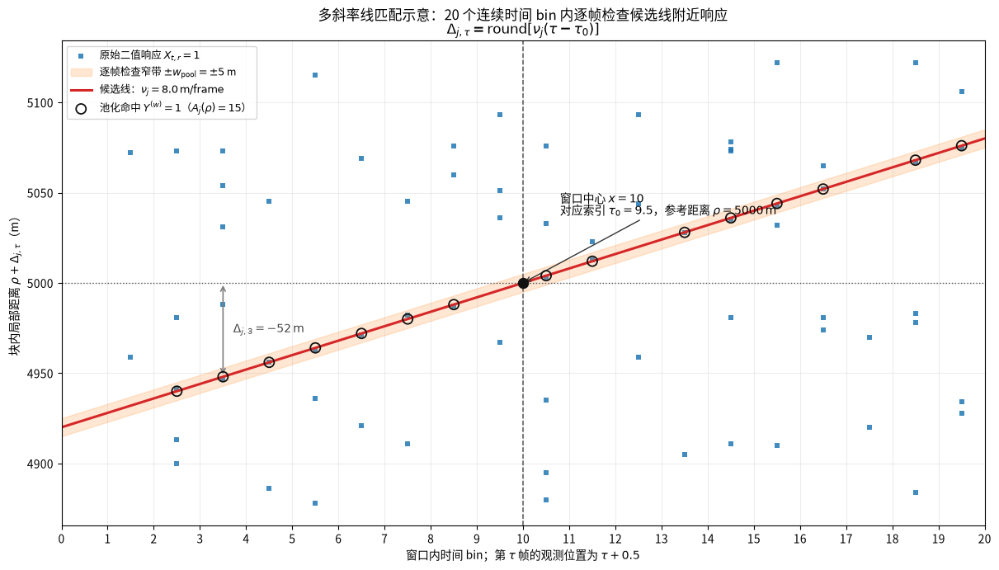

# BSN-MSLF：背景显著性归一化多斜率线匹配滤波

**英文名称：** Background-Significance-Normalized Multi-Slope Line Filtering  
**缩写：** BSN-MSLF

## 1. 方法概述

BSN-MSLF 是一个面向冷启动的**候选航迹生成器**
- 输入：二值观测矩阵 $X_{t,r}$
- 输出：少量具有全局距离、斜率和显著性得分的候选线。后续的动态规划、CNN 或低阶拟合模块只需在这些局部候选附近完成精细恢复，而无需反复扫描全部距离轴。

该方法的基本思想是寻找 **“相对于该距离位置正常背景噪声水平，额外出现了最多跨帧一致响应”** 的直线。整体按以下六步工作：

1. **时间-距离分块：** 从完整二值观测矩阵 $X_{t,r}$ 中取一个短时间窗和一个距离块；
2. **候选直线匹配：** 在最大速度范围内列出多组候选直线；对每条直线，逐帧检查它预测经过的距离位置是否出现响应，并累计 20 帧命中数。
3. **距离窄带池化：** 执行上述检查时，不只检查候选线恰好对应的 1 m bin，还同时检查左右几米；只要这个小范围内任一 bin 有响应，就把该帧记为一次命中。这样目标响应偏离预测线几米时，不会被误判为漏检。
4. **估计当前背景：** 直接从池化后的当前观测估计距离相关的背景命中概率；可与训练或历史背景曲线弱混合，并在初筛后遮罩候选线重估一次，以兼顾新场景适应性和远场稳定性。
5. **背景显著性归一化：** 将候选线的实际命中数减去其经过位置的背景期望，并按背景方差归一化；这使近场高底噪不会仅因绝对响应多而天然占优。
6. **候选压缩与精细恢复：** 对显著性图做块内 NMS、跨重叠块去重和局部细斜率搜索，保留 Top-$K$ 候选；随后仅裁剪候选窄带，交由动态规划、CNN 与拟合模块恢复 20 帧轨迹并外推下一帧位置。

因此，BSN-MSLF 的作用是把大规模、距离背景不均匀的二值响应矩阵，压缩为少量高召回、可解释且易并行的航迹假设

## 2. 输入、分块与符号约定

### 2.1 全局输入

本文符号与[数据合成方案](../../data/synthetic/_doc/数据合成方案.md)保持一致。完整观测样本满足：

$$
X_{t,r}\in\{0,1\},
\qquad
t\in\{0,1,\ldots,F-1\},
\qquad
r\in\{0,1,\ldots,R-1\}.
$$

其中 $F=300$、$R=300000$、帧间隔为 $\Delta t=0.05\,\mathrm{s}$。$X_{t,r}=1$ 表示第 $t$ 帧、距离 bin $r$ 存在响应

### 2.2 时间-距离分块与本地坐标

BSN-MSLF 使用时间-距离分块设计
- **时间分块**：时间分块的作用是将考察时长限制在**局部直线近似成立**的范围内。缺省设置 $F_{\mathrm{line}}=20$ 帧作为一条直线的匹配窗口。对起始帧为 $t_n$ 的时间窗，第 $m$ 个距离块的本地数据为：

    $$
    X^{(n,m)}_{\tau,d}
    =
    X_{t_n+\tau,\,r_m+d},
    \qquad
    \tau=0,1,\ldots,19,
    \qquad
    d=0,1,\ldots,W_R-1.
    $$

- **空间分块**：距离块宽度 $W_R$ 和步长 $S_R$ 均可按实现资源自由设置，只需满足

    $$
    1\le S_R\le W_R\le R,
    \qquad
    O_R=W_R-S_R\ge0.
    $$

    其中 $O_R$ 是相邻常规块的重叠宽度。第 $m$ 个距离块记为：

    $$
    \mathcal D_m = \{r\mid r_m\le r<r_m+W_R\}, \\
    $$

    其中

    $$
    r_m=\min\{mS_R,\,R-W_R\},
    \qquad
    m=0,1,\ldots,M-1,
    \qquad
    M=\left\lceil\frac{R-W_R}{S_R}\right\rceil+1.
    $$

    若希望不进行空间切分，直接设置

    $$
    W_R=S_R=R,
    \qquad
    O_R=0,
    \qquad
    M=1,
    \qquad
    r_0=0.
    $$

    这时唯一的距离块就是完整 $0\sim R-1$ 距离轴。**若 $M>1$，应令 $O_R$ 不小于单个时间窗内目标可能跨越的最大距离，以保证完整航迹包含在至少一个距离块中**；以当前 $v_{\max}=340\,\mathrm{m/s}$ 和 1 s 窗口作保守设置时，缺省设置 $O_R\ge340\,\mathrm{m}$。例如 $W_R=10\,\mathrm{km}$、$S_R=9\,\mathrm{km}$、$O_R=1\,\mathrm{km}$ 

下文使用 $(n,m)$ 表示起始帧为 $t_n$、起始距离为 $r_m$ 的时间-距离块，其尺寸为 $F_{\mathrm{line}}\times W_R$；单块模式下固定为 $(n,0)$。

### 2.3 符号约定

除合成方案已定义的 $F,R,t,r,B_{t,r},X_{t,r}$ 外，BSN-MSLF 使用以下符号。

| 符号 | 含义 |
|---|---|
| $F_{\mathrm{line}}$ | 单条线匹配的时间窗长度，固定为 20 帧 |
| $W_R,S_R,O_R$ | 距离块宽度、步长和重叠宽度 |
| $\mathcal D_m,r_m$ | 第 $m$ 个距离块及其全局起始距离 |
| $\mathcal R_k$ | 第 $k$ 个 1 km 距离组，与数据合成方案第 3.1 节一致 |
| $w_{\mathrm{pool}}$ | 距离最大池化半宽 |
| $Y^{(w)}_{t,r}$ | 宽度 $2w_{\mathrm{pool}}+1$ 的池化二值响应 |
| $\pi_w(r)$ | 假设该位置没有目标时，池化窗口仅由背景产生至少一个响应的单帧概率 |
| $\nu_j$ | 第 $j$ 个斜率假设，单位为 $\mathrm{m/frame}$ |
| $\rho$ | 候选线在窗口中心时刻对应的本地参考距离 |
| $s_{\rho}^{\mathrm{coarse}},s_{\rho}^{\mathrm{fine}}$ | 参考距离 $\rho$ 的粗、细搜索步长 |
| $\Delta_{j,\tau}$ | 第 $j$ 个斜率在局部帧 $\tau$ 的整数距离偏移 |
| $A^{(n,m)}(j,\rho)$ | 第 $n$ 个时间窗、第 $m$ 个距离块中候选线 $(j,\rho)$ 的池化命中计数 |
| $\mu^{(n,m)}(j,\rho)$ | 纯背景假设下，该候选线池化命中数的期望 |
| $\sigma^{(n,m)}(j,\rho)$ | 纯背景假设下，该候选线池化命中数的标准差 |
| $Z^{(n,m)}(j,\rho)$ | 将观测命中数减去背景期望、再除以背景标准差后的显著性得分 |
| $\omega_{k,\tau}$ | CNN 或动态规划给出的逐帧置信度 |
| $\gamma_k^{\mathrm{CNN}}$ | CNN 给出的整条候选置信度 |

## 3. 自适应池化背景模型
### 3.1 距离窄带最大池化

目标测距抖动、斜率离散误差和时间窗内的轻微曲率都会造成候选线与实际响应之间出现少量距离偏差。先在全局距离坐标上定义距离窄带最大池化响应：
$$
Y^{(w)}_{t,r}
=
\max_{|\delta|\le w_{\mathrm{pool}}}
X_{t,r+\delta}.
$$
它表示候选线在某帧附近只要出现至少一个响应就计为一次命中；同一帧内，距离窄带内的多个背景响应不会重复计分。
> 第一版粗筛建可取 $w_{\mathrm{pool}}=5\sim6\,\mathrm{m}$，为 20 帧内的微曲线偏差、测距抖动和 $0.5\,\mathrm{m/frame}$ 粗斜率离散保留的召回余量。候选细筛时可使用更细的斜率网格，并将半宽收紧至 $4\,\mathrm{m}$ 左右。

### 3.2 当前观测的经验池化概率

沿用数据合成方案中的 1 km 距离组：

$$
\mathcal R_k
=
\{r\mid 1000k\le r<1000(k+1)\},
\qquad
k=0,1,\ldots,299.
$$

第 $k$ 组的经验池化命中率为：

$$
\bar\pi^{\mathrm{obs}}_{w,k}
=
\frac{
\sum_{\tau=0}^{F_{\mathrm{line}}-1}
\sum_{r\in\mathcal R_k}
Y^{(w)}_{t_n+\tau,r}
}{
F_{\mathrm{line}}\,|\mathcal R_k|
}.
$$

其中 $\mathcal |R_k|=1000, F_{\mathrm{line}}=20$，$t_n$ 是起始时刻，$Y^{(w)}_{t,r}\in{0,1}$ 表示第 $t$ 帧、以 $r$ 为中心的窄带内是否至少有一个响应

对 300 个 $\bar\pi^{\mathrm{obs}}_{w,k}$ 做截尾损失拟合或 Huber 平滑，并插值回 1 m 距离轴，得到：

$$
\tilde\pi^{\mathrm{obs}}_w(r)
=
\operatorname{RobustSmooth}
\left[
\bar\pi^{\mathrm{obs}}_{w,k}
\right].
$$

平滑的有效尺度建议为 $1\sim3\,\mathrm{km}$。目标在 20 帧中最多经过 $340\,\mathrm{m}$，通常只影响一两个距离组；稳健拟合能避免该局部增量被直接吸收到背景曲线中。相比在 100–500 m 局部窗内估计，该尺度对远场稀疏背景也更稳定。

### 3.3 弱参考先验

纯当前观测估计会适应新场景，但在极稀疏远场的方差较大；固定训练模板则稳定，却可能与新场景失配。因此将训练背景或历史无目标数据构造的池化参考曲线 $\pi_w^{\mathrm{ref}}(r)$ 仅作为弱先验：

$$
\hat\pi_w(r)
=
\alpha(r)\tilde\pi^{\mathrm{obs}}_w(r)
+
\left[1-\alpha(r)\right]\pi_w^{\mathrm{ref}}(r),
\qquad
0\le\alpha(r)\le1.
$$

第一版可设常数 $\alpha(r)=0.7$，即当前样本统计为主、参考曲线为辅。远场若需要更稳定，可降低 $\alpha(r)$；若场景与训练背景差异很大，或没有可信参考曲线，可令 $\alpha(r)=1$，完全使用当前观测估计。

### 3.4 候选遮罩重估计
候选遮罩重估计是一个可选的第二阶段，发生在**粗匹配已经得到候选直线之后、最终筛选之前**；它不是在尚未知道候选线位置时预先进行。完整流程如下：

1. **初始粗匹配：** 用未遮罩数据估计的初始 $\hat\pi_w(r)$，对全部 $(\nu_j,\rho)$ 计算沿线池化命中数 $A^{(n,m)}(j,\rho)$ 和初始显著性得分 $Z^{(n,m)}(j,\rho)$，选出 Top-$K$ 条候选直线。
2. **按候选线遮罩：** 对每一条 Top-$K$ 候选线及每个局部帧 $\tau$，将其预测距离附近 $\pm w_{\mathrm{mask}}$ m 的时距单元暂时标记为不参与背景统计。重算 $\bar\pi^{\mathrm{obs}}_{w,k}$ 时，这些单元应同时从分子和分母中排除。
3. **重估背景：** 仅用剩余单元重新得到 $\tilde\pi^{\mathrm{obs}}_w(r)$，并与 $\pi_w^{\mathrm{ref}}(r)$ 融合为新的 $\hat\pi_w(r)$。
4. **最终筛选：** 使用新背景重新计算候选线的背景期望 $\mu^{(n,m)}(j,\rho)$、标准差 $\sigma^{(n,m)}(j,\rho)$ 和得分 $Z^{(n,m)}(j,\rho)$，再进行最终排序、NMS 与跨块去重。沿线命中数 $A^{(n,m)}(j,\rho)$ 仅由观测数据和池化结果决定，重估背景时无需重复计算。

该步骤的目的是避免真实目标响应被混入局部背景率，从而略微抬高该候选线的背景期望、削弱自身得分。对当前 20 帧、1 km 距离组的第一版 baseline，这种影响通常较小，因此可默认关闭；若远场虚警控制不稳定、距离分组变窄或同时存在多个强目标，再启用一次即可。建议 $w_{\mathrm{mask}}=10\sim15\,\mathrm{m}$，且不再迭代，以避免错误候选遮掉过多正常背景。

## 4. 多斜率线匹配与背景显著性
### 4.1 候选直线匹配
#### 4.1.1 候选直线的定义
每条候选直线由斜率和偏置定义：
- **斜率**：最大速度对应的帧间最大位移为 $\nu_{\max}=340\times0.05=17\,\mathrm{m/frame}$，粗搜索使用 $0.5\,\mathrm{m/frame}$ 步长，共 $N_\nu=69$ 个候选斜率 $\nu_j$：
    $$
    \nu_j
    =
    -17+0.5j,
    \qquad
    j=0,1,\ldots,68.
    $$
- **偏置**：使用考察时间-距离窗口中心时刻 $\tau_0=\frac{F_{\mathrm{line}}-1}{2}$ 的候选直线目标距离 $\rho$ 表示直线偏置。粗搜索在可行的参考距离中按步长 $s_{\rho}^{\mathrm{coarse}}$ 取样：

    $$
    \mathcal P^{\mathrm{coarse}}_{m,j}
    =
    \left\{
    \rho=q\,s_{\rho}^{\mathrm{coarse}} \middle|\ q\in\mathbb Z,\ 
    0\le\rho\le W_R-1
    \right\}.
    $$

    实际匹配需剔除因斜率导致超出块范围的 $\rho$，因此对每个斜率的参考距离候选数由约 $W_R$ 个降为约 $\lceil W_R/s_{\rho}^{\mathrm{coarse}}\rceil$ 个。第一版可取

    $$
    s_{\rho}^{\mathrm{coarse}}=4\,\mathrm{m}.
    $$

    对粗阶段保留的 Top-$K$ 候选 $(j,\rho_c)$，再在局部范围内逐米细搜：

    $$
    \rho\in
    [\rho_c-s_{\rho}^{\mathrm{coarse}},\ \rho_c+s_{\rho}^{\mathrm{coarse}}]
    \cap\mathbb Z,
    \qquad
    s_{\rho}^{\mathrm{fine}}=1\,\mathrm{m}.
    $$

    这样粗阶段降低搜索量，细阶段仍可恢复 1 m 级的中心距离

该定义下，参数 $(j,\rho)$ 唯一确定一条候选直线

#### 4.1.2 候选直线的池化命中次数
以候选直线中点距离 $\rho$ 为参考，定义第 $\tau\in\{0,\dots,F_{\mathrm{line}}-1\}$ 帧的整数距离偏移为：

$$
\Delta_{j,\tau}
=
\operatorname{round}
\left[
\nu_j(\tau-\tau_0)
\right].
$$

于是，第 $m$ 个距离块中 $(j,\rho)$ 对应候选线在第 $\tau$ 帧的全局预测距离为 $$r^{(m)}_{j,\rho}(\tau) = r_m+\rho+\Delta_{j,\tau}$$

在第 $n$ 个宽 $F_{\mathrm{line}}$ 的时间窗中，对每一条由 $(j,\rho)$ 确定的候选线，定义其池化命中计数为
$$
A^{(n,m)}(j,\rho)
=
\sum_{\tau=0}^{F_{\mathrm{line}}-1}
Y^{(w)}_{t_n+\tau,\,r^{(m)}_{j,\rho}(\tau)}
$$
即沿着该线，在每一帧检查一次预测位置附近是否有响应，然后把 $F_{\mathrm{line}}$ 次检查的结果相加

考察过程中，只保留被当前时间-距离块完整覆盖的候选直线，$A^{(n,m)}(j,\rho)\in[0,20]$ 表示这条候选线在 20 帧内获得的池化命中数。

### 4.2 背景显著性
若直接按候选直线的池化命中计数 $A^{(n,m)}(j,\rho)$ 排序，近场高背景会产生大量伪峰。因此，先假设候选线附近没有目标，只有纯背景噪声。此时 $\hat\pi_w\!\left(r^{(m)}_{j,\rho}(\tau)\right)$ 表示第 $\tau$ 帧在该候选线预测位置附近仅由背景产生一次池化命中的概率，即有
$$
Y^{(w)}_{t_n+\tau,\,r^{(m)}_{j,\rho}(\tau)}
\sim
\operatorname{Bernoulli}\Big(\hat\pi_w\!(r^{(m)}_{j,\rho}(\tau))\Big),
$$

- 定义**纯背景条件下**，在时间-距离块 $(n,m)$ 中沿候选线 $(j,\rho)$ 检查 $F_{\mathrm{line}}$ 帧时得到池化命中次数的期望为$\mu^{(n,m)}(j,\rho)$，它是逐帧背景命中概率之和，即
$$
\begin{aligned}
\mu^{(n,m)}(j,\rho)
&=
\mathbb E\!\left[
A^{(n,m)}(j,\rho)
\mid
\text{该候选线附近无目标}
\right].\\
&=\sum_{\tau=0}^{F_{\mathrm{line}}-1}
\hat\pi_w\!\left(r^{(m)}_{j,\rho}(\tau)\right).
\end{aligned}
$$

- 再定义 $\left[\sigma^{(n,m)}(j,\rho)\right]^2$ 为同一**纯背景条件下**候选线池化命中计数 $A^{(n,m)}(j,\rho)$ 的方差。由于命中次数 
    $$
    A^{(n,m)}(j,\rho)=\sum_{\tau=0}^{F_{\mathrm{line}}-1} Y^{(w)}_{t_n+\tau,\,r^{(m)}_{j,\rho}(\tau)}
    $$
    为一系列 Bernoulli 随机变量的和，每一帧的方差为 $p(1-p)$，进一步假设背景帧间池化响应概率独立，有
    $$
    \left[\sigma^{(n,m)}(j,\rho)\right]^2
    =
    \kappa_{\mathrm{bg}}
    \sum_{\tau=0}^{F_{\mathrm{line}}-1}
    \hat\pi_w\!\left(r^{(m)}_{j,\rho}(\tau)\right)
    \left[1-\hat\pi_w\!\left(r^{(m)}_{j,\rho}(\tau)\right)\right],
    $$
    其中 $\kappa_{\mathrm{bg}}\ge1$ 是背景方差膨胀系数，它为剩余相关性和帧级波动留出余量。

- 最后，用观测命中数相对背景期望的 “标准化超额” 定义显著性得分：
    $$
    Z^{(n,m)}(j,\rho)
    =
    \frac{
    A^{(n,m)}(j,\rho)-\mu^{(n,m)}(j,\rho)
    }{
    \sqrt{\left[\sigma^{(n,m)}(j,\rho)\right]^2+\varepsilon}
    }.
    $$

    其中 $\varepsilon>0$ 是防止分母为 0 的很小数值常数。$Z^{(n,m)}(j,\rho)$ 衡量的是**候选线相对于其经过距离区域的背景预期多出多少跨帧命中，而不是绝对命中数**。因此近场高响应率不会天然占优，远场低响应率中的方向一致响应也能得到合理提升。

## 5. 并行实现、NMS 与跨块去重

在一个 $20\times10000$ 块中，移位—累加是最直接的实现。对每个 $\nu_j$，按 $\Delta_{j,\tau}$ 读取 20 帧的池化结果并相加，即可一次得到该斜率下所有 $\rho$ 的 $A^{(n,m)}(j,\rho)$。输出张量大小为：

~~~
池化输入： (20, 10000)
匹配计数： (69, 10000)
显著性图： (69, 10000)
~~~

若输入足够稀疏，也可以将所有 $Y^{(w)}_{t,r}=1$ 的事件表示为 $(\tau,r_i)$。对于每个事件及每个斜率，计算：

$$
\rho_{i,j}
=
r_i-r_m-\Delta_{j,\tau},
$$

再执行：

$$
A^{(n,m)}(j,\rho_{i,j})
\mathrel{+}=1.
$$

这种事件投票实现的复杂度约为：

$$
O(N_{\mathrm{event}}N_\nu).
$$

对每个显著性图 $Z^{(n,m)}\in\mathbb R^{69\times10000}$ 执行二维 NMS，同时抑制距离接近与斜率接近的重复峰值。每个距离块先保留：

$$
\mathcal C_{n,m}
=
\left\{
(\nu_k,\rho_k,Z_k)
\right\}_{k=1}^{K},
\qquad
K=8\sim32.
$$

候选的全局中心距离为：

$$
r_k^{\mathrm{center}}
=
r_m+\rho_k.
$$

将所有重叠块的候选映射到全局坐标后，再执行一次全局 NMS。若两条候选在同一 20 帧窗口中的预测距离中位差较小，且斜率接近，则视为同一航迹的重复候选，只保留 $Z_k$ 更高者。这样既保留 1 km 重叠带来的边界召回率，又避免重复送入后续模块。

对保留的候选，可在：

$$
[\nu_k-0.5,\ \nu_k+0.5]\,\mathrm{m/frame}
$$

内，以 $0.1\sim0.25\,\mathrm{m/frame}$ 步长细搜；并在 $\rho_k$ 附近进行数米到数十米的局部距离细搜。细筛后的候选再使用较窄的 $w_{\mathrm{pool}}$ 重算得分。

## 6. 与动态规划、CNN、拟合和外推的衔接

BSN-MSLF 的职责是高召回候选生成，而不是独立完成最终逐帧坐标恢复。对细筛后的第 $k$ 条候选，定义其全局粗线为：

$$
r^{(0)}_{k,t_n+\tau}
=
r_{m_k}+\rho_k+\Delta_{k,\tau}.
$$

沿粗线从未池化的原始二值观测 $X_{t,r}$ 裁剪窄带：

$$
X'_k(\tau,u)
=
X_{t_n+\tau,\,r^{(0)}_{k,t_n+\tau}+u},
\qquad
u\in[-R_{\mathrm{crop}},R_{\mathrm{crop}}].
$$

其中 $R_{\mathrm{crop}}=32\sim64\,\mathrm{m}$。每条候选的输入大小为：

$$
F_{\mathrm{line}}\times(2R_{\mathrm{crop}}+1),
$$

即 $20\times65$ 或 $20\times129$。多个候选可组成：

$$
(K,1,20,2R_{\mathrm{crop}}+1)
$$

的 batch 输入 CNN。CNN 只需预测相对粗线的逐帧修正：

$$
\delta r^{\mathrm{CNN}}_{k,\tau},
\qquad
\tau=0,1,\ldots,19,
$$

逐帧置信度：

$$
\omega_{k,\tau},
$$

以及候选级置信度：

$$
\gamma_k^{\mathrm{CNN}}.
$$

恢复到全局距离坐标：

$$
\hat r_{k,t_n+\tau}
=
r^{(0)}_{k,t_n+\tau}
+\delta r^{\mathrm{CNN}}_{k,\tau}.
$$

也可以先不用 CNN，而在候选窄带中使用动态规划恢复逐帧路径。无论采用何种细化器，最终均可对可信坐标进行加权直线或二次曲线拟合：

$$
\min_{\boldsymbol\beta}
\sum_{\tau=0}^{19}
\omega_{k,\tau}
\left[
\hat r_{k,t_n+\tau}
-f_{\boldsymbol\beta}(t_n+\tau)
\right]^2.
$$

直线模型为：

$$
f_{\boldsymbol\beta}(t)
=
\beta_0+\beta_1t,
$$

二次模型为：

$$
f_{\boldsymbol\beta}(t)
=
\beta_0+\beta_1t+\beta_2t^2.
$$

候选总评分可综合候选显著性、细化器置信度、支持帧比例和拟合残差：

$$
\Gamma_k
=
a_1\gamma_k^{\mathrm{CNN}}
+a_2 Z_k
+a_3 R_k^{\mathrm{support}}
-a_4 E_k^{\mathrm{fit}}.
$$

当前假设单目标时，选择：

$$
k^*
=
\arg\max_k\Gamma_k.
$$

下一帧位置外推为：

$$
\hat r_{t_n+F_{\mathrm{line}}}
=
f_{\boldsymbol\beta_{k^*}}(t_n+F_{\mathrm{line}}).
$$

冷启动成功后，系统可切换至局部跟踪模式，只在外推位置附近裁剪距离区域；当局部跟踪置信度持续下降时，再回到全局分块 BSN-MSLF 搜索。

## 7. 推荐第一版参数

| 参数 | 推荐初值 | 说明 |
|---|---:|---|
| 完整样本 | $F=300$, $R=300000$ | 与数据合成方案一致 |
| 线匹配时间窗 $F_{\mathrm{line}}$ | 20 帧 | 首末相隔 0.95 s；当前微曲数据在此尺度内近似直线 |
| 距离块宽度 $W_R$ | 10 km | 统一的空间处理块 |
| 距离块步长 $S_R$ | 9 km | 对应 1 km 重叠；末端额外对齐至 300 km |
| 最大速度 | $340\,\mathrm{m/s}$ | 对应 $|\nu|\le17\,\mathrm{m/frame}$ |
| 粗斜率步长 | $0.5\,\mathrm{m/frame}$ | 共 69 个斜率假设 |
| 细斜率步长 | $0.1\sim0.25\,\mathrm{m/frame}$ | 仅对 Top-K 候选使用 |
| 粗参考距离步长 $s_{\rho}^{\mathrm{coarse}}$ | 4 m | 粗阶段按该步长枚举偏置，降低候选数 |
| 细参考距离步长 $s_{\rho}^{\mathrm{fine}}$ | 1 m | 仅在 Top-K 候选附近局部细搜 |
| 粗池化半宽 $w_{\mathrm{pool}}$ | $5\sim6$ m | 优先保证候选召回 |
| 细筛池化半宽 | 约 4 m | 配合细斜率搜索收紧 |
| 背景统计距离组 | 1 km | 与 $\mathcal R_k$ 定义一致 |
| 背景稳健平滑尺度 | 1–3 km | 避免目标局部污染并稳定远场 |
| 观测曲线混合权重 $\alpha$ | 0.7 | 当前观测为主、参考曲线为辅 |
| 候选遮罩半宽 $w_{\mathrm{mask}}$ | 10–15 m | 只做一次背景重估计 |
| 每块 Top-K | 8–32 | 冷启动阶段优先 Recall@K |
| 窄带半宽 $R_{\mathrm{crop}}$ | 32–64 m | CNN / 动态规划的局部输入 |

## 8. Baseline 与评测

建议在完全相同的 $20\times10\,\mathrm{km}$ 分块、1 km 重叠和全局去重协议下比较：

1. 原始 Hough：直接按投票数排序；
2. MSLF：池化后的多斜率匹配，仅使用 $A^{(n,m)}(j,\rho)$；
3. BSN-MSLF：使用自适应 $\hat\pi_w(r)$ 与显著性得分 $Z^{(n,m)}(j,\rho)$；
4. BSN-MSLF + 动态规划：在候选窄带内恢复逐帧路径；
5. BSN-MSLF + CNN：由 BSN-MSLF 生成高召回候选，由 CNN 判断和修正局部轨迹。

冷启动阶段应记录：

- Recall@1、Recall@5、Recall@10、Recall@20；
- 候选中心距离误差与斜率误差；
- 不同距离区间的虚警率；
- 使用 $A^{(n,m)}(j,\rho)$ 与 $Z^{(n,m)}(j,\rho)$ 时的候选排名变化；
- 仅当前观测、仅参考曲线、弱混合三种背景策略的差异；
- 候选遮罩重估计前后的排名变化；
- 单个 $20\times10\,\mathrm{km}$ 块及完整冷启动搜索耗时。

完整系统还应记录：

- 20 帧轨迹平均坐标误差；
- 下一帧距离预测误差；
- 首次航迹捕获成功率；
- 稳态跟踪丢失率；
- 边缘设备单次更新耗时。

BSN-MSLF 的定位不是最终端到端预测模型，而是一个高召回、可解释、易并行的候选航迹生成器。它利用 20 帧内的方向一致性在全距离范围分块搜索未知速度目标，并以当前场景为主、参考背景为辅地校正距离相关噪声，从而把大规模二值时距数据压缩为少量候选窄带，再交由动态规划、CNN 和低阶拟合完成精细提取与外推。
