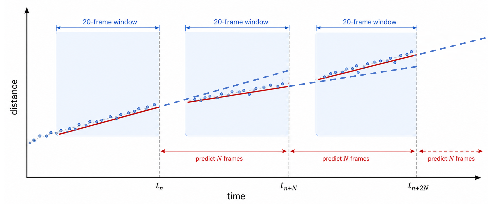
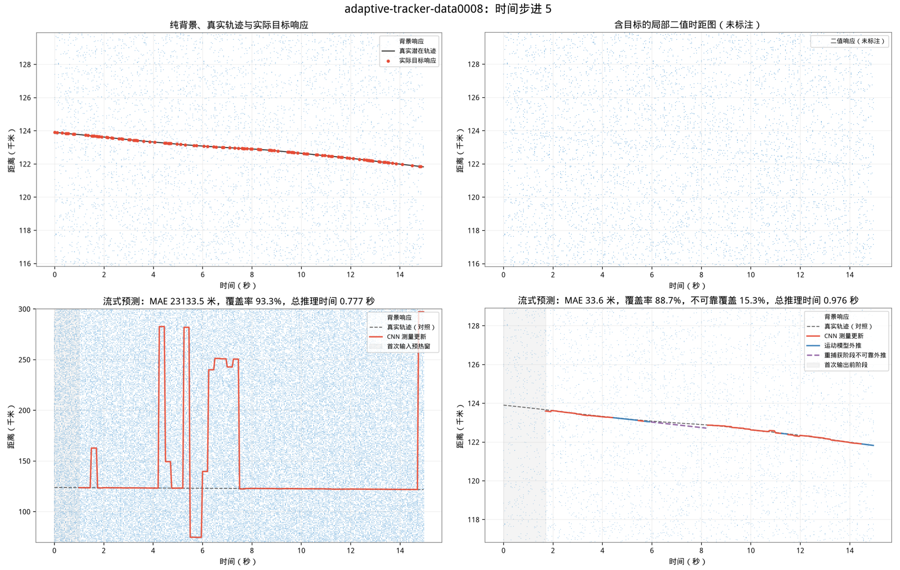
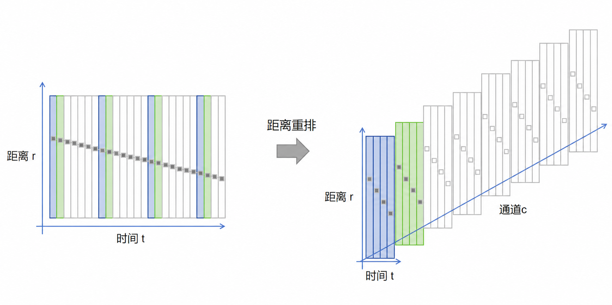
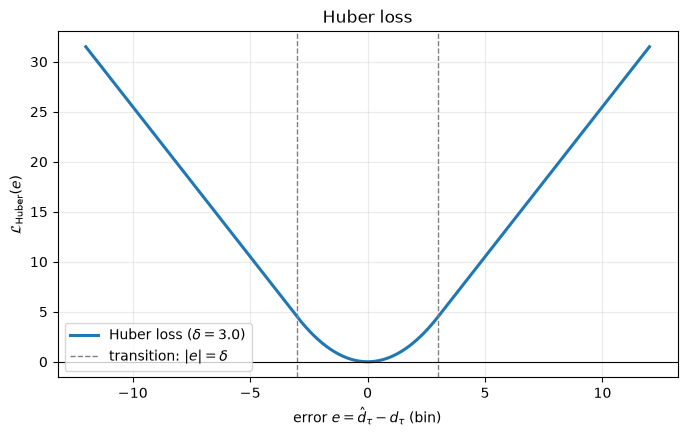

# SimpleCNN：分块单直线全局回归基线

SimpleCNN 是面向激光单光子测距航迹冷启动的纯 CNN 基线。该方法不进行显式背景概率建模或线匹配滤波预处理，而是直接从原始二值时间—距离块中回归一条最可能的局部直线，验证轻量 CNN 能否直接从完整局部块中提取唯一目标直线，并回归其置信度、中心距离和斜率

## 1. 总体流程

SimpleCNN 方法依赖三个重要假设：

1. **目标运动特性假设**：短时间窗口内（默认1s）目标做近似为匀速直线运动，该假设影响目标轨迹线建模方式和模型输出结构设计
2. **目标最大速度假设**：目标运动速度绝对值不超过 340m/s，该假设影响距离分块重叠大小
3. **目标数量假设**：观测区域内只存在一个目标，该假设影响后处理方法设计

本方法原始输入为最近 1s 内 20 帧观测数据构成的二值矩阵 $X\in\{0,1\}^{20\times300000}$，系统首先沿距离轴将 $X$ 划分为若干尺寸为 $[20,10000]$ 的重叠局部块，将每个局部块距离重排 reshape 到 $[8,20,1250]$ 尺寸后，拼成 batch 形式 $[\text{B},8,20,1250]$ 输入 SimpleCNN 模型，模型输出尺寸为 $[\text{B},3]$，即每个局部块输出 $(\hat q,\hat\rho,\hat\nu)$ 三个预测值，其中：

- $\hat q\in[0,1]$：当前块完整包含一条可见目标轨迹直线的置信度
- $\hat\rho$：中间时刻目标块内距离
- $\hat\nu$：块内目标轨迹直线斜率，单位为 $\mathrm{m/frame}$

在 $t_n$ 时刻完成模型前向计算后，通过后处理外推预测此后 $N$ 帧的目标距离。然后在 $t_{n+N}$ 时刻，取最近的 20 帧观测数据重复以上流程



当前考察两种方法：

- **全局 q-Top1**：总是将所有局部块输入模型计算，选择 $\hat q$ 最大的局部块，外推其预测目标轨迹直线，这种方式计算量大，且没有引入帧间约束
- **自适应推理**：使用 “捕获—跟踪—重捕获” 状态机动态调整输入模型的局部块数量，提升预测速度，且自然引入帧间约束




## 2. 分块与无损距离重排

### 2.1 参数设置

第一版使用以下参数：
- 分块时间窗长度 $F_{\mathrm{line}}=20$
- 分块距离跨度 $W_R=10000\ \mathrm m$
- 距离方向滑动步长 $S_R=9000\ \mathrm m$
- 距离方向相邻块重叠宽度 $O_R=W_R-S_R=1000\ \mathrm m$
- 最大目标速度取 $340\ \mathrm{m/s}$，帧间隔为 $0.05\ \mathrm s$，对应每帧最大距离变化 $|\nu_{\max}|=340\times0.05=17\ \mathrm{m/frame}$。20 帧中共有 19 个时间间隔，因此最大首末跨距约为 $17\times19=323\ \mathrm m$，可被分块间距离重叠区域覆盖，因此**至少存在一个距离块能够完整包含整条 20 帧轨迹**

根据以上设置，距离方向常规块起点为 $0,9000,18000,\ldots,288000$，为了完整覆盖最后 2000 m，额外设置固定尾块 $[290000,300000)$，因此总块数为 34

### 2.2 距离重排

对于起始帧为 $t_n$、起始距离为 $r_m$ 的时间-距离块，其输入为：
$$
X_{t_n+\tau,r_m+d}, \quad \tau=0,\ldots,19, \quad d=0,\ldots,9999
$$

原始局部输入形状为 $[1,20,10000]$，直接在其上堆叠多层卷积的计算量较高，因此先做维度变换，把原始距离轴按 “mod 8” 拆开，即距离索引 $\bmod 8=s$ 的放到 channel $s$。重排后张量形状变为 $[8,20,1250]$



重排后，最大斜率约为 $\frac{17}{8}\approx2.125$ 距离组/帧，20 帧最大跨度约为 $\frac{323}{8}\approx40.4$ 个距离组。因此

- 网络沿距离方向的有效感受野应至少覆盖 40～50 个距离组，使卷积特征本身能看到目标在 20 帧内可能跨越的距离
- 当前训练流以 `standard_positive_fraction=0.30` 的概率采用标准 9 km 步进网格，其余正样本在可行起点区间内随机裁剪；因此随机裁剪部分会自然覆盖不同的距离模 8 相位，避免模型依赖固定的 8 m 分组

通过重排将原始距离坐标映射到多通道压缩坐标空间，在保持全部单光子响应信息的同时，将每帧横向跨距从 17m 压缩至约 $2.125$ 个距离组；**同一大小的卷积核因而覆盖更大的物理距离，更适合表征长距离稀疏航迹**。


## 3. 任务参数化与标签定义

### 3.1 建模

当前假设每个局部块中最多只有一条真实目标轨迹，任务整体更**类似全局图像分类**，因此不必采用 YOLO 式多候选检测头，也不在每个距离位置生成候选线，而是直接回归一组块内全局参数 $(\hat q,\hat\rho,\hat\nu)$ 

- 网络预测的局部直线模型为：
  $$
  \hat\ell_\tau=\hat\rho+\hat\nu(\tau-\tau_0)
  $$

  - $\tau$：块内时刻索引 $\tau=0,\ldots,19$
  - $\tau_0$：块内中间时刻索引 $\tau_0=\frac{19}{2}=9.5$
  - $\hat\ell_\tau$：$\tau$ 时刻预测的目标块内距离
  - $\hat\rho$：中间时刻预测的目标块内距离
  - $\hat\nu$：预测的局部直线斜率

- 进一步定义以下符号：

  - 目标响应掩码：$I_\tau=
    \begin{cases}
    1, & \text{第 }\tau\text{ 帧存在已标注的目标响应},\\
    0, & \text{第 }\tau\text{ 帧目标漏检}.
    \end{cases}$
  - 目标响应的块内相对距离 $d_\tau\in\{0,1,\ldots,W_R-1\}$（单位 m）；仅在 $I_\tau=1$ 时 $d_\tau$ 有定义
  - 时间窗口内的目标响应数 $H=\sum_{\tau=0}^{19}I_\tau$

- 根据当前块是否完整包含一条可见目标轨迹定义置信度标签按 $q^*$：

  | 样本类型       | 条件                               | $q^*$ | 监督置信度标签 | 监督几何标签 |
  | -------------- | ---------------------------------- | ----: | -------------: | -----------: |
  | 可见正样本     | 潜在轨迹完整位于块内，且 $H>0$     |     1 |             是 |           是 |
  | 零证据样本     | 潜在轨迹完整位于块内，但 $H=0$     |     - |             否 |           否 |
  | 部分相交负样本 | 潜在轨迹与块相交，但未完整位于块内 |     0 |             是 |           否 |
  | 背景负样本     | 潜在轨迹与块完全不相交             |     0 |             是 |           否 |

### 3.2 训练样本划分

由于相邻块存在重叠，一条真实轨迹可能同时与多个块相交。训练样本分为：

- **正样本**：20 帧目标实际轨迹完整位于当前块内的样本为正样本，根据漏检情况，可进一步分为
  - **可见正样本：** 至少存在一次实际目标响应，即 $H>0$。它们以相同权重参与预测直线的几何损失；即使只有很少目标响应，也不降低几何回归权重，以免破坏模型从高漏检低质量样本中检测目标的能力
  - **零证据样本：** 所有目标响应全部漏检，即 $H=0$。图像中没有证据可判断潜在轨迹是否位于块内，因此不监督置信度头，也不进入训练
- **部分相交负样本：** 潜在轨迹与当前块相交，但在块边界被截断，以 $q^*=0$ 监督置信度头，帮助后处理优先锁定完整目标块
- **背景负样本：** 真实轨迹与当前块完全没有交集，只以 $q^*=0$ 监督质量头，帮助后处理锁定目标块

## 4. 网络结构：经典 CNN 全局回归基线

SimpleCNN 采用 LeNet/AlexNet 风格的经典卷积回归结构，不使用 YOLO 式多候选检测头，也不使用残差网络、深度可分离卷积、注意力模块或显式 Hough 层。第一版结构为：

```text
输入 [B, 8, 20, 1250]
        ↓
Conv2d：8 → 16
kernel=(3,5)，stride=(1,2)，padding=(1,2)
        ↓
BatchNorm + ReLU
        ↓
Conv2d：16 → 32
kernel=(3,5)，stride=(1,2)，padding=(1,2)
        ↓
BatchNorm + ReLU
        ↓
Conv2d：32 → 64
kernel=(3,5)，stride=(1,2)，padding=(1,2)
        ↓
BatchNorm + ReLU
        ↓
Conv2d：64 → 64
kernel=(3,3)，stride=(2,2)，padding=(1,1)
        ↓
BatchNorm + ReLU
        ↓
Conv2d：64 → 96
kernel=(3,3)，stride=(2,2)，padding=(1,1)
　       ↓
BatchNorm + ReLU
　       ↓
Conv2d：96 → 96
kernel=(5,3)，stride=(1,1)，padding=(0,1)
　       ↓
BatchNorm + ReLU
　       ↓
Flatten
　       ↓
Linear：3840 → 256
        ↓
ReLU + Dropout
        ↓
三个输出头
├─ 置信度 q
├─ 中心距离 ρ
└─ 斜率 ν
```

对应的特征尺寸大致变化为：

```text
[8, 20, 1250]
→ [16, 20, 625]
→ [32, 20, 313]
→ [64, 20, 157]
→ [64, 10, 79]
→ [96, 5, 40]
→ [96, 1, 40]
→ Flatten：3840
→ 256
→ (q, ρ, ν)
```

每层卷积特征图的感受野和相邻特征点对应的原始时间/距离间隔为：

| 层    | 时间核/步幅 | 距离组核/步幅 | 时间感受野 | 相邻特征点时间间隔 | 距离组感受野 | 相邻特征点距离组间隔 |
| ----- | ----------- | ------------- | ---------- | ------------------ | ------------ | -------------------- |
| input | -           | -             | 1          | 1                  | 1            | 1                    |
| Conv1 | $3/1$       | $5/2$         | 3          | 1                  | 5            | 2                    |
| Conv2 | $3/1$       | $5/2$         | 5          | 1                  | 13           | 4                    |
| Conv3 | $3/1$       | $5/2$         | 7          | 1                  | 29           | 8                    |
| Conv4 | $3/2$       | $3/2$         | 9          | 2                  | 45           | 16                   |
| Conv5 | $3/2$       | $3/2$         | 13         | 4                  | 77           | 32                   |
| Conv6 | $5/1$       | $3/1$         | 29         | 4                  | 141          | 32                   |

前三层只压缩距离维，保留 20 帧的时间排列；随后两层同时压缩时间维和距离维。最后的 $5\times3$ 卷积将 5 个时间位置融合为 1 个时间位置，使最终高层特征显式覆盖整个 20 帧窗口，同时保留 40 个距离位置供 $\hat\rho$ 回归使用。当前设置三种模型规格

- `model_type=n` 对应以上表格
- `model_type=xn` 保持卷积核、步进和输出接口不变，将各层通道数与共享 MLP hidden dim 缩小为 n 的 0.5 倍
- `model_type=s` 保持卷积核、步进和输出接口不变，将各层通道数与共享 MLP hidden dim 放大为 1.5 倍

单卡训练使用普通 BatchNorm；CUDA 或 Ascend NPU 多卡 DDP 训练使用 SyncBatchNorm，使均值和方差按全部 rank 的 micro-batch 共同统计

### 4.1 为什么采用 Flatten 而不是池化

SimpleCNN 模型只使用步幅大于 1 的卷积完成下采样，这让网络自行决定哪些局部二值结构该保留，池化层可以提供更强的局部平移不变性，但也会导致特征细节损失。由于更深的特征图通道数较高，且 MLP 的线性层计算量大，为保证计算效率，需要控制 Flatten 尺寸，因此需仔细考虑下采样方法。模型的三个输出中，从任务定义看，$\nu$ 和 $q$ 应尽量对块内距离平移保持不变，**而块内中心距离 $\rho$ 必须随目标位置平移而改变**，因此

- 对于时间维度，最后一层可以使用 $5\times3$ 卷积将时间维度融合到 1 维。该卷积核对不同时刻及相邻距离位置设置不同的可学习权重，同时沿距离轴共享，因此可识别 “任意距离处的相同斜线局部模式”

- 对于距离维度，不宜在局部时空特征充分提取前，使用覆盖全部 40 个距离位置的 $3\times40$ 卷积将距离维直接压缩到 1。该操作会在每个时间位置把整个距离轴混合为一个全局特征。虽然卷积核对不同距离位置具有不同权重，理论上可以编码目标位于何处，但它将 “局部斜线模式识别” 和 “绝对位置编码” 耦合在同一个全局模板中：目标沿距离平移后，需要依赖另一组全局权重组合来响应，局部模式难以在不同位置复用，数据效率较低。

  同样，不宜在 $\rho$ 回归前沿距离维使用全局平均池化或全局最大池化。忽略 padding 和边界效应时，这类池化会将平移后的局部特征压缩为近似相同的全局表示，从而抹去目标位于块内哪个距离区域的信息；除非额外提供坐标通道或独立的位置编码，否则不利于绝对中心距离 $\rho$ 回归。

  当前结构先用局部、权重共享的卷积提取可平移复用的时空线特征，再保留 40 个距离位置并进行 Flatten。此时全连接层为不同距离位置设置固定的输入权重是有益的：网络既能利用 “何处出现轨迹特征” 回归 $\hat\rho$，又不必为每个绝对位置重复学习同一种局部斜线模式。

综合考虑，SimpleCNN 最终将时间维融合为 1，并保留 40 个距离位置，再进行 Flatten，在位置可辨识性和参数规模之间取得折中

### 4.2 更复杂结构

以下结构暂不加入第一版：

- 残差块；
- 深度可分离卷积；
- 注意力模块；
- CoordConv；
- YOLO-1D 或中心热图；
- Deep Hough；
- BSN-MSLF 特征；

这些模块更适合作为基础模型跑通后的增量实验。第一版保持简单，有利于判断性能瓶颈究竟来自数据、标签、网络容量还是任务本身。


## 5. 输出约束与损失函数

### 5.1 输出头

共享全连接特征经过三个独立输出头，得到 $(\hat q,\hat\rho,\hat\nu)$

- **置信度头**：使用 sigmoid 函数控制输出区间为 $(0,1)$
  $$
  \hat q=\sigma(z_q) \in (0,1)
  $$

- **中心距离头**：使用 sigmoid 函数控制输出区间为 $(0,1)$，代表归一化的中心距离，推理时乘以块距离宽度 10km 恢复块内距离
  $$
  \hat\rho_{\mathrm{norm}}=\sigma(z_\rho) \in (0,1)
  $$

  $$
  \hat\rho=W_R\hat\rho_{\mathrm{norm}}
  $$

- **斜率头**：使用 tanh 函数控制输出区间为 $(-1,1)$，然后根据最大目标速度约束调整
  $$
  \hat\nu=17\tanh(z_\nu) \in(-17,17)\ \mathrm{m/frame}
  $$

### 5.2 损失函数

损失由置信度损失和几何损失两部分加权求和得到。对 batch 中第 $b$ 个样本，记置信度损失为 $\mathcal L_{q,b}$、几何损失为 $\mathcal L_{\mathrm{line},b}$，第 $b$ 个样本的损失贡献定义为：
$$
\mathcal L_b
=
\lambda_qm_{q,b}\mathcal L_{q,b}
+
\lambda_{\mathrm{line}}m_{\mathrm{line},b}\mathcal L_{\mathrm{line},b}.
$$

- 其中 $\lambda_q, \lambda_{\mathrm{line}}$ 是两部分损失权重，$m_q, m_{\mathrm{line}}$ 是损失计算 mask，定义为：

$$
m_q=
\begin{cases}
0, & \text{零证据样本} \\
1, & \text{其余样本}
\end{cases},
\quad \quad
m_{\mathrm{line}}=
\begin{cases}
1, & \text{可见正样本} \\
0, & \text{其余样本}
\end{cases}
$$

- 所有可见正样本均以相同权重参与几何回归，即使漏检严重也不会主动弱化降权，以免模型过度保守
- 零证据样本不参与损失计算，视作不存在
- 部分相交负样本和背景负样本只以 $q^*=0$ 监督置信度头


由于两类损失的有效监督样本数可能不同，实际 batch 总损失分别归一化为：
$$
\begin{aligned}
\mathcal L
={}&
\lambda_q
\frac{\sum_b m_{q,b}\mathcal L_{q,b}}
{\max\left(\sum_b m_{q,b},1\right)}+
\lambda_{\mathrm{line}}
\frac{\sum_b m_{\mathrm{line},b}\mathcal L_{\mathrm{line},b}}
{\max\left(\sum_b m_{\mathrm{line},b},1\right)}.
\end{aligned}
$$
其中 $b$ 表示 batch 内的样本索引；$\max(\cdot,1)$ 只用于当前 batch 没有对应监督样本时防止除零。

#### 5.2.1 置信度损失

置信度头采用带二值目标的二元交叉熵损失，并通过 $m_q$ 忽略零证据样本：

$$
\mathcal L_q
=
\frac{\sum_b m_{q,b}\,\mathcal L_{\mathrm{BCE}}(\hat q_b,q_b^*)}
{\max\left(\sum_b m_{q,b},1\right)}
$$

- 正样本块以 $q^*=1$ 推动模型输出高置信度；
- 部分相交负样本和背景负样本以 $q^*=0$ 推动模型输出低置信度；
- 零证据样本不提供置信度监督。

实际实现时可以直接使用 `BCEWithLogitsLoss(z_q, q^*)`，由损失函数内部完成 Sigmoid 和二元交叉熵计算，以提高数值稳定性。

#### 5.2.2 逐帧响应距离 bin 几何损失

中心距离头和斜率头共同确定预测直线在每一帧经过的距离 bin。第 3.1 节已将 $d_\tau$ 定义为第 $\tau$ 帧实际目标响应在当前块内的零基距离 bin；仅当 $I_\tau=1$ 时该标签存在。由于距离分辨率固定为 $1\ \mathrm{m/bin}$，本节直接用以 m 计的数值表示距离 bin 坐标，二者数值相同。**基于标签形式考虑，不分别构造中心距离和斜率的真值标签，而是直接优化目标响应的距离 bin 误差**，预测距离 bin 为连续值：

$$
\hat d_\tau
=
\hat\rho+\hat\nu(\tau-\tau_0).
$$

对有实际目标响应的帧，直接比较实际响应距离与预测距离 bin 的误差：

$$
\mathcal L_{\mathrm{line}}
=
\frac{1}{S_{\mathrm{line}}H}
\sum_{\tau=0}^{19}
I_\tau\,
\mathcal L_{\mathrm{Huber}}
\left(
\hat d_\tau-d_\tau
\right),
\qquad
H=\sum_{\tau=0}^{19}I_\tau.
$$

$I_\tau$ 是损失掩码，漏检帧不产生几何误差，除以 $H$ 后每个可见正样本的几何损失保持相近的总体尺度；固定损失尺度 $S_{\mathrm{line}}=5000$，用于把物理距离上的 Huber 损失缩放到与置信度 BCE 相近的数值范围，避免几何损失因物理量纲主导总损失，该尺度不取代 $\lambda_{\mathrm{line}}$，后者继续控制总损失对几何优化的偏向

设距离 bin 误差为 $e=\hat d_\tau-d_\tau$，Huber 损失定义为：
$$
\mathcal L_{\mathrm{Huber}}(e)
=
\begin{cases}
\frac{1}{2}e^2,
&
|e|\le\delta
\\
\delta
\left(
|e|-\frac{1}{2}\delta
\right),
&
|e|>\delta
\end{cases}
$$

其中 $\delta$ 的单位为 bin（m），表示平方损失和线性损失的切换阈值。Huber 损失在误差较小时采用平方形式，有利于精细定位；在误差较大时近似线性增长，相比均方误差不容易受到测距抖动、微曲线偏离或偶发错误标签的过度影响




## 6. 训练数据与采样

一份完整全局样本通常只有 1～2 个可见正块，却有 30 多个部分相交或背景负块。训练 batch 采用：

$$
N_{\mathrm{positive}}:N_{\mathrm{negative}}=1:3
$$

当前训练流以可见正样本为正类，并在完整轨迹加边界裕量可落入块内的起点区间中，混合标准网格与随机起点裁剪，避免 Flatten + MLP 学到固定的块内位置先验。负样本按配置权重从四类来源抽取：同时间窗的局部困难负样本、同时间窗按 $0$～$10$/$10$～$50$/$50$～$300$ km 分层抽取的负样本、随机时间—距离负样本，以及轨迹被块边界截断的部分相交负样本。当前实现尚未进行基于模型高分误检的 hard negative mining。

数据集应按完整背景序列或完整全局样本划分训练集、验证集和测试集，不能随机打散局部块，避免相邻块和同源背景造成数据泄漏。


## 7. 批量推理、q-Top-1 与外推

完整 $20\times300000$ 数据切分为 34 个局部块：

```text
[34, 1, 20, 10000]
        ↓
无损距离重排
        ↓
[34, 8, 20, 1250]
        ↓
SimpleCNN
        ↓
34 组预测 (q, ρ, ν)
```

相邻块重叠时，同一条真实轨迹可能产生多个接近预测，当前直接取 q-top1 预测 $k^*=\arg\max_{m\in\{0,\ldots,33\}}\hat q_m$ 实现去重，这与 “按 $\hat q$ 降序去重后再取最高分” 的**单目标**输出在最终结果上等价

考虑预测外推，首先把第 $m$ 个块的局部中心距离映射为全局距离 $\hat\rho_m^{\mathrm{global}}=r_m+\hat\rho_m$，定义时间窗中间时刻 $\tau_0=9.5$。输入帧索引为 $0,\ldots,19$；

- 推理时间步进为 1 帧时，下一帧索引为 20，因此下一帧距离预测为：
  $$
  \hat r_{t_n+20}
  =
  \hat\rho_{k^*}^{\mathrm{global}}
  +
  10.5\hat\nu_{k^*}
  $$

- 推理时间步进为 $S_T>1$ 时，用同一条局部直线填充其后的 $S_T$ 帧；第 $j$ 个未来帧（$j=0,\ldots,S_T-1$）为：
  $$
  \hat r_{t_n+20+j}
  =
  \hat\rho_{k^*}^{\mathrm{global}}
  +
  (10.5+j)\hat\nu_{k^*}.
  $$

上述流程对应 `global_top1` 推理基线。实际使用经过优化的 `adaptive_tracker` 推理方法：

- CAPTURE/RECAPTURE 阶段对全局34块直接取 q-Top-1，先以 `capture_q_min` 过滤候选，再在多个历史时刻间做运动补偿与中位数支持确认
- TRACK 阶段仅推理预测位置附近的 $1/3/5$ 个块，再对该局部 batch 直接取 q-Top-1，并按 $q$ 门限、融合后的瞬时速度门限和历史平均速度门限决定是否更新状态

该状态机的参数和状态转换见 `_doc/postprocess.md`


## 8. Baseline 对照与后续边缘优化

全局34块 q-Top1 是当前的基础对照；自适应捕获—跟踪—重捕获已作为独立推理方法实现，但不改变 CNN 的训练标签和网络结构。基础对照重点验证：

- 正负块能否可靠区分；
- 中心距离 $\hat\rho$ 能否稳定回归；
- 斜率 $\hat\nu$ 能否准确回归；
- 下一帧外推误差是否满足要求；
- 34 块 batch 的端到端延迟，并将其作为后续优化的基线。

当前训练与推理运行时已通过 `amp` 配置支持 FP16/BF16 自动混合精度；其延迟收益仍应按具体设备实测。以下仍属于后续可逐步加入的边缘部署优化：

1. **INT8 量化**：后训练量化或量化感知训练；
2. **缩减通道数和全连接宽度**；
3. **深度可分离卷积**；
4. **结构化剪枝与知识蒸馏**；
5. **推理图编译和算子融合**；

当前自适应推理已实现冷启动全局34块、稳定跟踪局部 $1/3/5$ 块的切换；它应与每步全局34块 Top-1 基线并列评估，而不是替代该对照。
