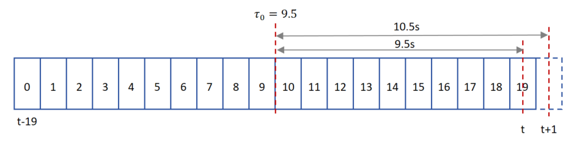
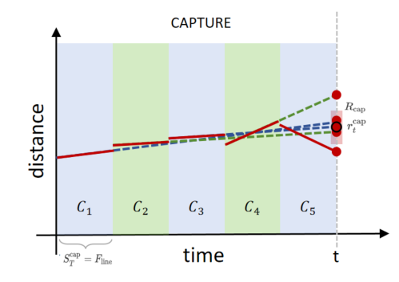
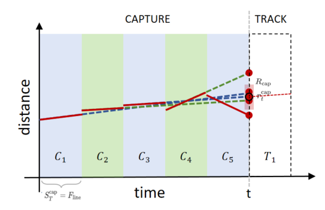
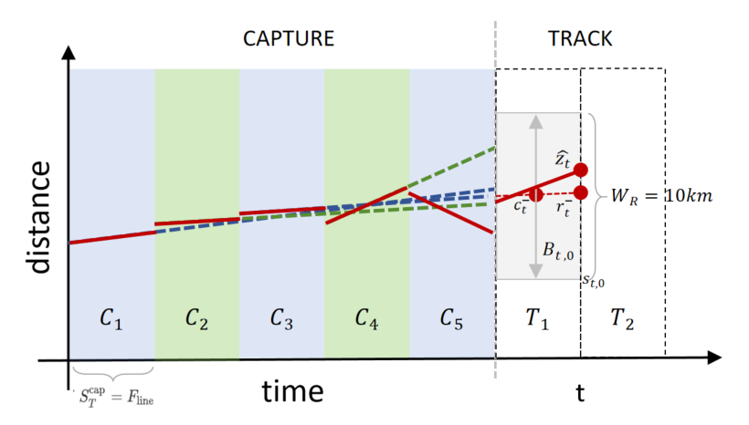
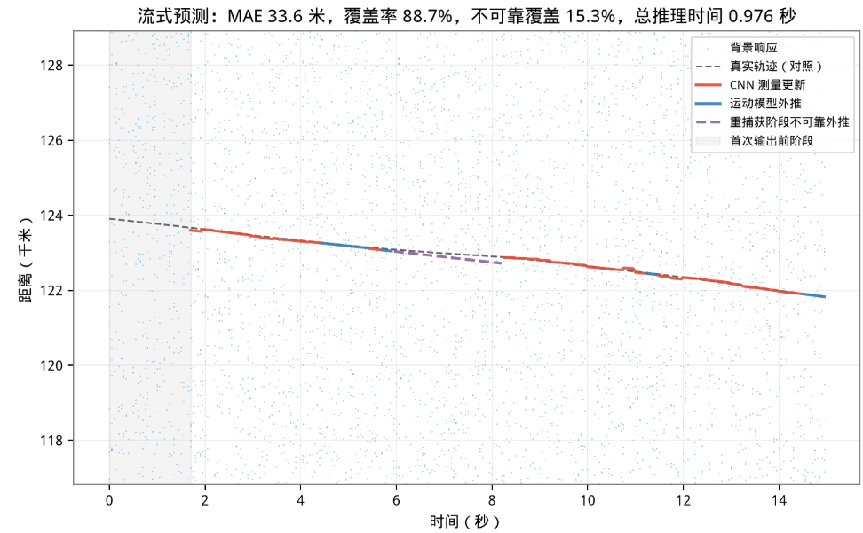

# SimpleCNN：高效流式推理与后处理

## 1. 目标与约束

SimpleCNN 对一个 $20\times10000$ 时间—距离块输出 $(\hat q,\hat\rho,\hat\nu)$ 三个预测值，其中：

- $\hat q\in[0,1]$：当前块完整包含一条可见目标轨迹直线的分类分数/置信度
- $\hat\rho$：中间时刻目标块内距离
- $\hat\nu$：块内目标轨迹直线斜率，单位为 $\mathrm{m/frame}$

本文设计一个面向实时运行的 “捕获—跟踪—重捕获” 后处理方法，遵循以下思想：

1. 每批候选只采信 $\hat q$-Top1 块的目标预测结果，不维护 Topk 多目标假设
2. 使用运动连续性过滤不合理跳变
3. 得到预测目标轨迹后，暂时不考虑读取原始响应数据重新评估质量
4. 跟踪稳定后只推理目标附近的少量距离块，实现计算加速
5. 只在捕获和重捕获时执行全局扫描

本文默认沿用以下超参数：
- 分块时间窗长度 $F_{\mathrm{line}}=20$
- 分块距离跨度 $W_R=10000\ \mathrm m$
- 距离方向滑动步长 $S_R=9000\ \mathrm m$

完整 $0\sim300\ \mathrm{km}$ 距离轴共划分为 $M=34$ 个标准块


## 2. 符号定义

在当前时刻 $t$，最近20帧窗口记为 $\{t-19,t-18,\ldots,t\}$。块内时间索引为 $\tau=0,\ldots,19$，中心时刻为 $\tau_0=\frac{19}{2}=9.5$。如下图所示，中心时刻后 9.5 帧为当前时刻 $t$，后 10.5 帧为下帧时刻 $t+1$，



基于直线轨迹假设，对于起始距离为 $r_m$ 的第 $m$ 个块

- 窗口中心帧距离为：$\hat r_t^{\mathrm{center},(m)}=r_m+\hat\rho_t^{(m)}$
- 窗口最新帧距离为：$\hat z_t^{(m)}=r_m+\hat\rho_t^{(m)}+9.5\hat\nu_t^{(m)}$
- 下一帧候选位置为：$\hat z_{t+1}^{(m)}=r_m+\hat\rho_t^{(m)}+10.5\hat\nu_t^{(m)}$

后续的候选比较、距离统计和运动连续性判断统一使用最新帧位置 $\hat z_t$。对于 $t$ 时刻一次实际推理的块集合 $\mathcal M_t$

- 记目标存在置信度最高的块索引为  $m_t^*=\underset{m\in\mathcal M_t}{\arg\max}\;\hat q_t^{(m)}.$
- 记 q-top1 块预测结果为 $C_t=\left(\hat q_t^{(m_t^*)},\hat z_t^{(m_t^*)},\hat \nu_t^{(m_t^*)}\right).$

根据模式不同，时间方向有两种步进：
- $S_T^{\mathrm{cap}}$ 表示 CAPTURE/RECAPTURE 模式下的全局扫描时间窗滑动步进；
- $S_T^{\mathrm{track}}$ 表示 TRACK 模式下的局部扫描时间窗滑动步进。


## 3. 状态与总体流程

后处理器维护三个工作状态：

```text
CAPTURE：全局捕获
    ↓ 
    ↓ 多次全局 q-top1 预测在运动补偿后形成稳定聚集
    ↓ 
TRACK：局部跟踪
    ↓ 
    ↓ 连续多次无有效局部候选
    ↓ 
RECAPTURE：全局重捕获
    ↓ 
    ↓ 重新形成稳定候选
    ↓ 
TRACK
```


### 3.1 捕获模式

#### 3.1.1 Top-1 缓存

捕获模式下还不知道目标大致位于哪个距离，因此需要在完整 $0\sim300\ \mathrm{km}$ 距离范围内搜索。第 $i$ 次扫描时，考察当前时刻 $t_i$ 之前最近 20 帧窗口，取全部34个标准距离块组成一个 batch 送入 SimpleCNN。得到 q-top1 候选 $C_{t_i}$

由于相邻20帧窗口高度重叠，捕获阶段不一定需要每到一帧就重复一次全局扫描。定义捕获扫描步进为：

$$
t_{i+1}-t_i
=
S_T^{\mathrm{cap}},
\qquad
S_T^{\mathrm{cap}}=2\sim5\ \text{frames}.
$$
单次全局 Top-1 可能来自背景误报，因此还需要观察它能否在多次扫描中持续出现在一致的运动轨迹附近。在 $t$ 时刻，已缓存最近 $K_t$ 次扫描的 Top-1 候选
$$
\mathcal C_t
=
\left\{
C_{t_1},C_{t_2},\ldots,C_{t_{K_t}}
\right\},
\qquad
t_1<t_2<\cdots<t_{K_t}\le t.
$$
仅当 Top-1 候选满足 $q_{\mathrm{top1}}\ge q_{\mathrm{cap}}$ 时，才允许写入缓存；默认 $q_{\mathrm{cap}}=0.5$。设通过该门限的候选缓存容量上限为 $K_{\mathrm{cap}}$，使用先进先出的滑动缓存。后续捕获判断就是检查这组候选在经过运动补偿后，是否集中到同一个距离区域。

#### 3.1.2 捕获确认

捕获目标的作用是把目标定位到一个10 km块内，以便在 TRACK 模式中控制输入模型的局部块数量，并自然引入目标最大速度等约束，减少帧间预测跳变。由于目标持续移动，不能直接对不同时刻的 $\hat z_{t_i}$ 做固定距离直方图，需把此前 $t_i$ 时刻 Top-1 候选 $C_{t_i}$ 的目标距离预测 $\hat z_{t_i}$ 外推到 $t$ 时刻，即
$$
\tilde z_{t_i\rightarrow t}
=
\hat z_{t_i}
+(t-t_i)\hat\nu_{t_i}.
$$
将全部缓存外推位置的**中位数**作为候选目标距离，并定义支持该中位数的历史预测集合及数量：

$$
\begin{aligned}
r_t^{\mathrm{cap}} &=\operatorname{median}\left\{\tilde z_{t_i\rightarrow t}:i=1,\ldots,K_t\right\} \\ 
\mathcal A_t^{\mathrm{cap}} &=\left\{i:\left|\tilde z_{t_i\rightarrow t}-r_t^{\mathrm{cap}}\right|\le R_{\mathrm{cap}}\right\} \\
N_t^{\mathrm{cap}} &=\left|\mathcal A_t^{\mathrm{cap}}\right|.
\end{aligned}
$$

其中 $R_{\mathrm{cap}}$ 是判断多次外推位置是否聚集在同一目标附近的 “位置一致性半径”，默认取 500m。在以下条件满足时认为捕获成功并切换到 `TRACK`：

1. **缓存已满，保证已经考察足够的时间长度**：$K_t=K_{\mathrm{cap}}$；

2. **支持中位捕获位置的候选数足够多**：$N_t^{\mathrm{cap}}\ge M_{\mathrm{cap}}$，该阈值可以用比例形式描述：
   $$
   M_{\mathrm{cap}}=\left\lceil\eta_{\mathrm{cap}}K_{\mathrm{cap}}\right\rceil.
   $$
   默认取 $\eta_{\mathrm{cap}}=0.7$，即要求严格多数的历史候选支持同一中位位置，这样少量偶发的全局 Top-1 误报不会主导捕获结果。

为便于绘制，**本文档所有图像使用展示了 $S_T^{\mathrm{cap}}=S_T^{\mathrm{track}}=F_{\mathrm{line}}$ 的特殊情况，根据参数设置，以下蓝绿条带时间窗可能重叠或不连续**



- CAPTURE/RECAPTURE 模式下，在 $t$ 时刻考察最近的 $K_t$ 个时间窗内的目标距离预测结果
- 首先把所有预测轨迹外推到的窗口最新帧（ $t$ 时刻），得到当前预测距离中位数 $r_t^{\mathrm{cap}}$（黑边红点）
- 然后考察落入位置一致性半径（浅红色框）的预测点数目，一旦满足捕获条件则转入 TRACK 模式

#### 3.1.3 模式切换

根据最近预测结果的外推位置确认捕获后，取支持集 $A_t^{\mathrm{cap}}$ 中预测直线斜率 $\hat\nu_{t_i}$的中位数，
$$
\nu_t^{\mathrm{cap}}
=
\operatorname{median}
\left\{
\hat\nu_{t_i}:
i\in\mathcal A_t^{\mathrm{cap}}
\right\}.
$$

立即生成一条斜率为 $\nu_t^{\mathrm{cap}}$，过 $r_t^{\mathrm{cap}}$ 点的综合预测直线，外推 $F_{\mathrm{line}}$ 帧得到 TRACK 模式第一个时间步进内的目标位置预测



### 3.2 跟踪模式

#### 3.2.1 根据预测中心距离选择局部块

定义 TRACK 相邻两次局部时间窗最新帧的步进为：

$$
t_{i+1}^{\mathrm{track}}-t_i^{\mathrm{track}}
=
S_T^{\mathrm{track}}.
$$

局部跟踪不使用默认 34 块的固定到标准距离网格，而是基于当前预测目标位置动态构造宽 $W_R$ 的块。在 $t$ 时刻，以上一个 TRACK 状态 $(r_{t-S_T^{\mathrm{track}}},\nu_{t-S_T^{\mathrm{track}}})$ 做匀速外推：

$$
r_t^-
=
r_{t-S_T^{\mathrm{track}}}
+S_T^{\mathrm{track}}\nu_{t-S_T^{\mathrm{track}}},
\qquad
\nu_t^-
=
\nu_{t-S_T^{\mathrm{track}}}.
$$

最近 20 帧窗口中心时刻的运动预测距离为：
$$
c_t^-
=
r_t^-\;-\;\frac{19}{2}\nu_t^-.
$$

以此为中心截取总宽度为 $W_R$ 的中心块，其起点为：

$$
s_{t,0}
=
\operatorname{clip}_{[0,\,300000-W_R]}
\left(
\operatorname{round}
\left[
c_t^-\;-\;\frac{W_R}{2}
\right]
\right).
$$

正常跟踪时只推理该块：

$$
\mathcal B_{t,0}
=
[s_{t,0},s_{t,0}+W_R),
\qquad
\mathcal M_t^{(0)}
=
\{\mathcal B_{t,0}\}.
$$

其中 $M_t^{(0)}$ 是搜索等级 $L=0$ 时的前向计算块集合，该最小搜索等级下集合尺寸为1。如下图所示，在 $t$ 时刻回顾最近 $F_{\mathrm{line}}$ 帧时间窗 $T_1$ 内的外推预测轨迹（红色虚线），找到中间时刻距离 $c_t^-$，上下截取宽 $W_R$ 的时间-距离局部块，送入 SimpleCNN 模型，得到时间窗 $T_1$ 内的即时预测目标轨迹（红色实线）



当搜索质量变差，多次无法通过以下 3.2.3 描述的质量门控时，按 “增加完整 $W_R$ 块” 的粒度向远近扩展。相邻局部块的起点相隔 $S_R=9\ \mathrm{km}$，因此相邻 $W_R=10\ \mathrm{km}$ 块仍保留1 km重叠。具体扩展和收缩逻辑见 3.2.4 节

| 搜索等级             | 实际推理块                        |
| -------------------- | --------------------------------- |
| $L=0$                | 中心 $W_R$ 块，共1块              |
| $L=1$                | 中心块加左右各1个 $W_R$ 块，共3块 |
| $L=2$                | 中心块加左右各2个 $W_R$ 块，共5块 |
| $L=2$ 再达到扩大条件 | 不再扩大局部范围，进入全局重捕获  |

形式化地，对 $k=-L,\ldots,L$，定义：

$$
s_{t,k}
=
\operatorname{clip}_{[0,\,300000-W_R]}
\left(
s_{t,0}+kS_R
\right),
$$

$$
\mathcal B_{t,k}
=[s_{t,k},s_{t,k}+W_R),
\qquad
\mathcal M_t^{(L)}
=
\left\{
\mathcal B_{t,k}:k=-L,\ldots,L
\right\}.
$$

$\mathcal M_t^{(L)}$ 中的所有局部块组成 batch 并行执行一次 CNN 前向，再从其中选取局部 q-Top1 预测作为即时预测目标轨迹

#### 3.2.2 状态更新

SimpleCNN 给出局部 q-top1 预测直线后，考察上一个 TRACK 状态与当前候选：

- 设上一个 TRACK 状态为 $\left(r_{t-S_T^{\mathrm{track}}},\nu_{t-S_T^{\mathrm{track}}}\right)$，按 3.2.1 节外推得到当前最新帧预测 $\left(r_t^-,\nu_t^-\right)$
- 设当前局部块集合 $\mathcal M_t^{(L)}$ 的 q-top1 候选为 $\left(\hat q_t,\hat z_t,\hat\nu_t\right)$，其中 $\hat z_t$ 是其最新帧距离

设两者之差为：$e_t=\hat z_t-r_t^-$。先构造用于连续性门控的暂定 $\alpha$-$\beta$ 更新：
$$
\begin{aligned}
r_t^+&=r_t^-+\alpha e_t\\
\nu_t^{\mathrm{pos}}&=\nu_t^-+\beta\frac{e_t}{S_T^{\mathrm{track}}}
\end{aligned}
$$

> $\alpha$-$\beta$ 滤波是一种简化的 “匀速运动 + 测量纠偏” 方法。考察预测位置残差 $e_t>0$ 说明 SimpleCNN 认为目标比运动预测更远，反之则更近。以上两步修正中：
>
> - $\alpha\in[0,1]$：对 SimpleCNN 本次位置测量的信任程度
> - $\beta\ge0$：根据位置偏差修正速度的力度
> - $S_T^{\mathrm{track}}$：两次 TRACK 状态更新之间的时间窗步进帧数
>
> 直觉上：
>
> - $\alpha=0$：完全不信 CNN 位置，只做匀速外推；
> - $\alpha=1$：完全采用 CNN 本次位置；
> - $\beta=0$：位置可以纠正，但速度永远不因位置偏差而调整；
> - $\beta$ 越大：持续出现的位置偏差会更快地改变后续斜率。
>
> 当前默认参数是 $\alpha=0.8,\ \beta=0.1$，即比较信任通过门控的 CNN 距离，但对速度修正更保守

可再以较小权重 $\gamma$ 融合 CNN 直接给出的斜率，得到暂定速度，默认设 $\gamma=0$：
$$
\nu_t^+
=
(1-\gamma)\nu_t^{\mathrm{pos}}
+\gamma\hat\nu_t.
$$

第 3.2.3 节门控通过后，才将 $(r_t^+,\nu_t^+)$ 写入内部状态 $(r_t,\nu_t)$；若门控拒绝，则保留 $(r_t^-,\nu_t^-)$。本文统一以 $S_T^{\mathrm{track}}$ 作为相邻 TRACK 状态之间的时间步进，并将其用作速度修正的分母。

#### 3.2.3 预测质量门控

按 3.2.2 节得到 $t$ 时刻最近时间窗内目标轨迹直线的综合预测结果 $(\nu_t, r_t)$ 后，还需评估其质量来决定是否采信。设当前局部块集合 $\mathcal M_t^{(L)}$ 给出 q-top1 候选为 $\left(\hat q_t,\hat z_t,\hat\nu_t\right)$，当且仅当以下条件满足时认为本次 CNN 候选可信：

- **目标存在置信度超过阈值**：$\hat q_t\ge q_{\mathrm{keep}}$

- **更新后的瞬时速度不过限**：根据当前搜索等级 $L$，要求 $|\nu_t|\le V_{\mathrm{inst}}(L)$

- **历史平均速度不过限**：当 TRACK 历史已覆盖至少 $N_{\mathrm{avg}}$ 帧时，往前取不晚于 $t-N_{\mathrm{avg}}$ 时刻的最近状态锚点（时间窗最新帧）时刻 $t_0$ 及预测距离 $r_{t_0}$，根据当前搜索等级 $L$，要求
  $$
  \left|\frac{r_t-r_{t_0}}{t-t_0}\right|
  \le V_{\mathrm{avg}}(L).
  $$
  当历史长度不足 $N_{\mathrm{avg}}$ 帧时，仅使用瞬时速度门控

如果候选没有通过门控，本步不更新 CNN 测量，保留上一个可信结果 $r_t=r_t^-,\space\space \nu_t=\nu_t^-$。这允许跟踪器跨过少量低置信度或漏检步进，同时避免错误候选形成距离跳变

#### 3.2.4 搜索范围的扩大与收缩

局部搜索使用迟滞机制：

- 候选变差时快速扩大搜索范围；
- 候选恢复后连续稳定若干步再缓慢收缩；
- 不因单次好坏结果在两个等级之间反复振荡。

根据预测质量门控结果动态决定搜索范围的扩大和收缩，并在连续失败时切换到 `RECAPTURE`  模式重新全局搜索

- **搜索等级扩大条件**：预测质量门控**连续未通过**次数达到 $N_{\mathrm{expand}}$ 时，搜索等级扩大一级，即 $L\leftarrow L+1$。若已经处于 $L=2$ 且再次达到扩大条件，则清空捕获缓存并进入 `RECAPTURE` 模式
- **搜索等级缩小条件**：预测质量门控**连续通过**次数达到 $N_{\mathrm{shrink}}$ 时，搜索等级缩小一级，即 $L\leftarrow \max(0,L-1)$

一般取 $N_{\mathrm{shrink}}>N_{\mathrm{expand}}$，实现 “快速扩大、缓慢收缩”

### 3.3 重捕获模式

当局部搜索已处于 $L=2$、且再次连续失败达到 $N_{\mathrm{expand}}$ 时，进入 `RECAPTURE`。当前重捕获模式直接复用 3.1 节的全局捕获流程：

1. 清空旧的捕获缓存，并丢弃旧轨迹状态；
2. 每次扫描推理全部34个标准距离块，保留全局 $q$-top1；
3. 按第 3.1.2 节进行目标捕获确认；
4. 确认成功后，按第 3.1.3 节切换至 `TRACK` 模式

在 `RECAPTURE` 模式下，本方法无法产生可靠预测结果，但仍可持续外推 `TRACK` 模式下最后一次可靠预测目标轨迹直线，避免出现无输出时间段



如图所示：

- 灰色块为 `CAPTURE` 模式，此时无输出预测结果
- 红色线为 `TRACK ` 模式下，质量门控通过时，结合最新 SimpleCNN 模型预测调整的可靠预测结果
- 蓝色线为 `TRACK ` 模式下，质量门控未通过，且尚未进入 `RECAPTURE` 模式时，从最近一个可靠预测轨迹外推的预测结果
- 暗紫色虚线为 `RECAPTURE` 模式下，从最近一个可靠预测轨迹做不可靠外推的预测结果

## 4. 当前实现的参数与标定

本节列出当前 `run_infer.py` 命令行入口的实际默认参数。它们是未经精细调参的可运行配置，而不是已经完成验证集最优标定的推荐值

| 参数 | 当前默认值 | 作用 |
| --- | ---: | --- |
| $S_T^{\mathrm{track}}$ | $5$ 帧 | TRACK 相邻时间窗最新帧的步进，也是每次状态更新后向未来写出预测的帧数，并作为速度修正的时间分母。 |
| $S_T^{\mathrm{cap}}$ | $2$ 帧 | `CAPTURE`/`RECAPTURE` 相邻全局扫描窗口的步进；不参与 $\alpha$-$\beta$ 更新的分母。 |
| $K_{\mathrm{cap}}$ | $8$ | 捕获缓存容量；缓存满后才允许确认。 |
| $\eta_{\mathrm{cap}}$ | $0.7$ | 捕获位置中位数所需的最小支持比例，因此 $M_{\mathrm{cap}}=\lceil0.7\times8\rceil=6$。 |
| $R_{\mathrm{cap}}$ | $500\ \mathrm m$ | 外推位置相对捕获距离中位数的支持半径。 |
| $q_{\mathrm{keep}}$ | $0.5$ | 接受局部 q-Top1 候选所需的最低分类分数。 |
| $V_{\mathrm{inst}}(0,1,2)$ | $(20,25,30)\ \mathrm{m/frame}$ | L=0/1/2 下，暂定 $\alpha$-$\beta$ 更新速度的绝对值上限。 |
| $V_{\mathrm{avg}}(0,1,2)$ | $(17,25,34)\ \mathrm{m/frame}$ | L=0/1/2 下，以历史位置锚点计算的平均速度绝对值上限。 |
| $N_{\mathrm{avg}}$ | $10$ 帧 | 启用平均速度门控所要求的最短真实帧跨度。 |
| $N_{\mathrm{expand}}$ | $2$ | 连续门控失败达到该次数后，局部搜索等级扩大一级。 |
| $N_{\mathrm{shrink}}$ | $4$ | 连续门控通过达到该次数后，局部搜索等级缩小一级。 |
| $\alpha$ | $0.8$ | 对通过门控的候选位置进行更新的权重。 |
| $\beta$ | $0.1$ | 将位置残差折算为速度修正的权重。 |
| $\gamma$ | $0$ | 直接融合 CNN 候选速度的权重；当前只由位置残差修正速度。 |
| $W_R,S_R$ | $10\ \mathrm{km},9\ \mathrm{km}$ | 分别由模型配置的 `block_width_m` 与 `spatial_step_m` 提供；局部相邻块保留 $1\ \mathrm{km}$ 重叠。 |
| 最大搜索等级 | $L=2$ | 对应最多 $5$ 个局部块；该等级仍连续失败时进入 `RECAPTURE`。 |


## 5. 当前实现的评估与落盘结果

每个源序列、每种方法和 $S_T^{\mathrm{track}}$ 都在独立目录下写出以下结果：

- `metrics.json`：该样本的精简数值摘要；
- `log.jsonl`：逐逻辑步的模式、候选、门控与状态诊断；
- `visualize.png`：启用绘图时生成的诊断图。

### 5.1 轨迹质量

`metrics.json` 的 `trajectory` 当前保存以下主指标：

| 指标 | 含义 |
| --- | --- |
| `coverage` | 真值有效帧中具有非 nan/inf 预测距离的比例。 |
| `unreliable_coverage` | 整个序列中由 `RECAPTURE` 临时匀速外推写出的预测比例；这些预测仍计入总体 `coverage` 与误差统计。 |
| `mae_m`、`rmse_m`、`abs_error_p95_m` | 所有已覆盖帧相对潜在真实轨迹的绝对误差统计。 |
| `hit_coverage`、`hit_mae_m` | 仅在实际目标响应存在的帧上重新计算的覆盖率和 MAE；只用于离线评估，不参与推理。 |
| `jump_count` | 相邻两帧均有预测时，预测距离变化超过 `jump_threshold_m`（默认 $1000\ \mathrm m$）的次数。跨越 NaN 空洞的两点不计为跳变。 |

### 5.2 计算量、时延与状态机统计

`compute` 保存 `logical_steps`、`blocks_evaluated`、`forward_calls`，以及按实际扫描块数估算的卷积/线性层总 MACs 与 FLOPs。它用于比较局部跟踪相对“每步全局34块”带来的实际扫描量节省。

`timing` 保存整个样本的端到端、预处理和模型前向累计耗时，以及逻辑步端到端时延的均值和 P95；同时按窗口最新帧记录 `CAPTURE`、`RECAPTURE`、`Track-L0/L1/L2` 的逐步时延。当前 `metrics.json` 不保存 P99 时延，尽管底层统计函数能够计算该值。

对 `adaptive_tracker`，`tracker` 额外保存：首次捕获是否成功、首次捕获延迟帧数、进入重捕获次数、重捕获成功次数和平均延迟，以及全局捕获扫描次数、局部扫描次数。

### 5.3 后续应补充的比较

当前输出尚未分别统计“当前帧估计”和“下一帧预测”的误差，也未汇总每步平均块数、P99 时延、错误轨迹切换次数及三种模式的驻留时长。后续应在固定验证序列上补齐这些指标，并同时保留“每步全局34块 q-Top1”作为对照。只有在轨迹精度和覆盖率接近或优于该对照，同时显著降低实际扫描块数和高分位时延时，局部自适应后处理才算真正有效。
